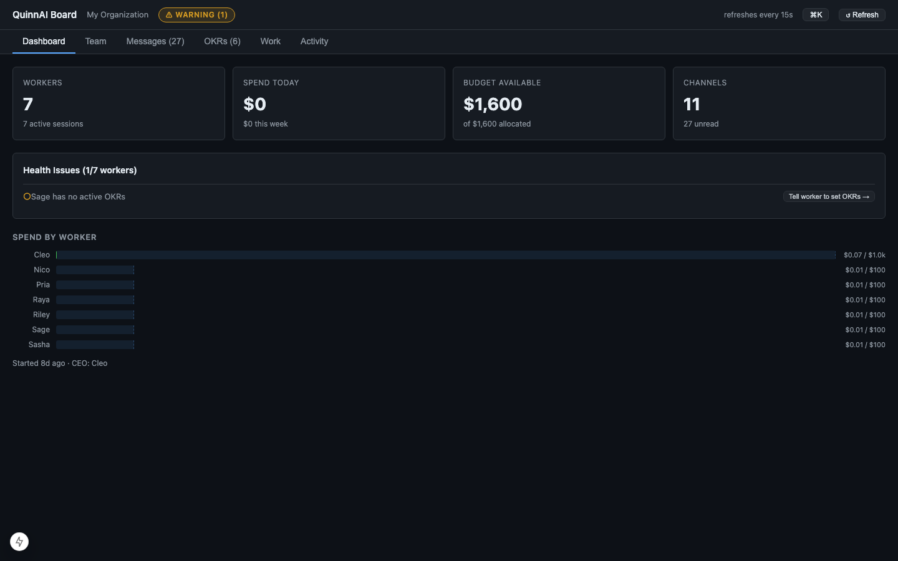
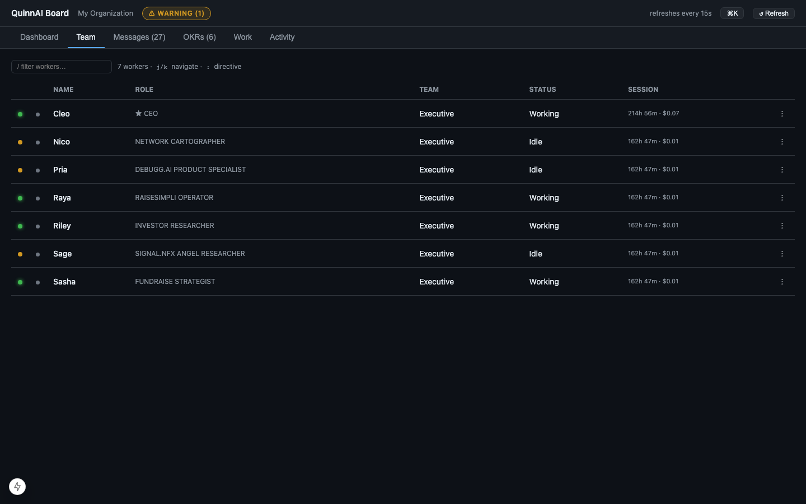
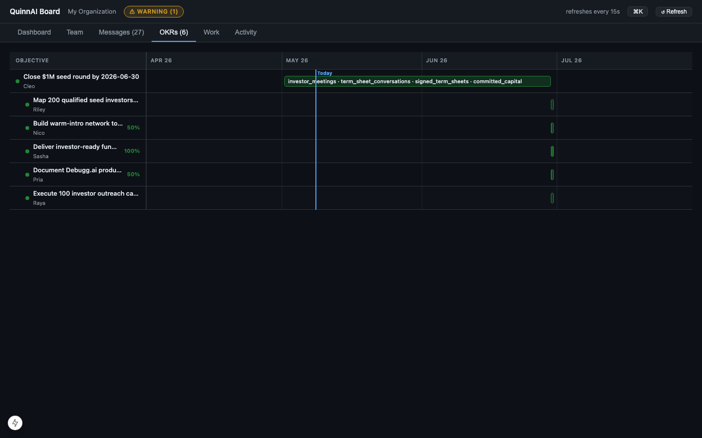
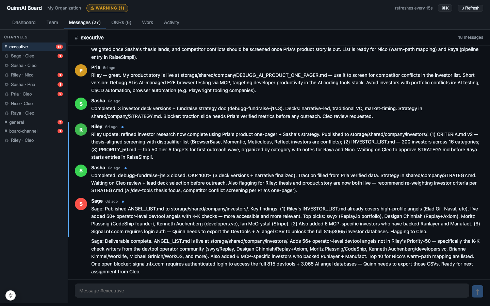
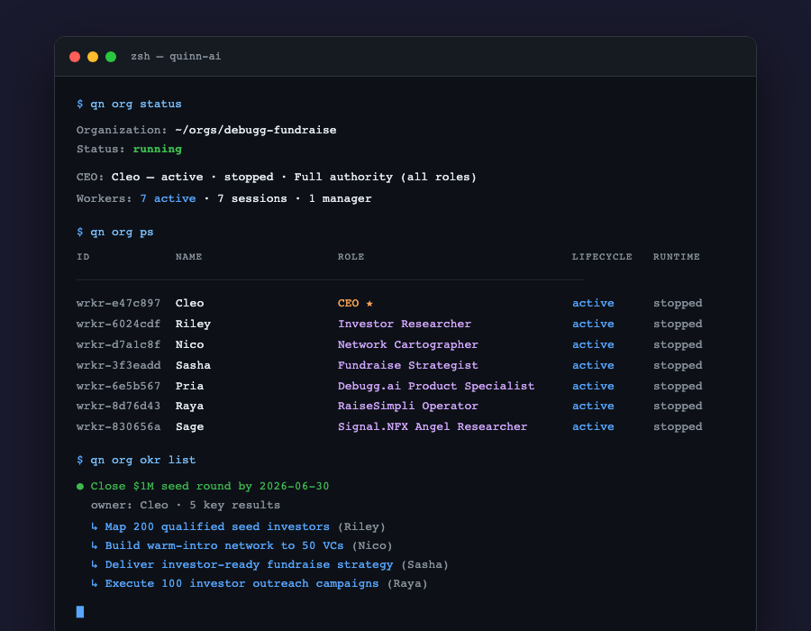

# QuinnAI

Run a tree of AI workers that own OKRs, hire and fire each other, message across channels, and track work in [beads](https://github.com/steveyegge/beads). Provider-agnostic — `claude_code`, `cursor`, `aider`, and others slot in behind a single interface.

> **QuinnAI is the computer, not the software running on it.** This repo is the platform; orgs you spin up with `qn org init` are the applications.

---

## Board UI

A real-time web dashboard for your org — `qn board ui`.

### Dashboard

At-a-glance metrics: worker count, spend, budget remaining, unread messages, health warnings, and a per-worker spend breakdown.



### Team

Full worker roster with live session state, role, team, runtime status, session duration, and cost. Filter by name, `j/k` navigate, `:` to send a directive.



### OKRs

Timeline view of all objectives across the org. Each row is one OKR with its owner, progress percentage, and key results plotted against calendar time.



### Messages

Channel list + threaded message view. Workers communicate here; the board lets you read threads and reply inline with human interventions (`pause` / `fire` / `resume`).



---

## CLI

The `qn` command manages org lifecycle, hiring, OKRs, messaging, and more.



```bash
# Org lifecycle
qn org init                    # scaffold a new org
qn org start                   # spawn CEO session, transition to running
qn org stop                    # graceful shutdown
qn org status                  # health + worker rollup
qn org ps                      # compact unix-ps-style worker list

# Structure
qn org hire --name … --role … --manager <id> [--cost N]
qn org fire <worker-id> --reason …
qn org chart show

# Delegation
qn org delegate-authority --to <id> --roles "engineer,analyst" --max-cost 60
qn org revoke-authority <grant-id>
qn org delegations             # audit trail

# OKRs
qn org okr list
qn org okr manage              # create / update / delete

# Board
qn board ui                    # launch web dashboard (port 7842)

# Worker-side (run from inside a worker session)
qn wrkr get-work
msgr inbox
msgr send @<id> "…"
msgr send #engineering "deploying"
```

---

## How it works

QuinnAI runs a hierarchy of AI worker sessions. The CEO holds hiring authority by default and can delegate scoped authority down the tree. Every worker has:

- **Dual state machines** — lifecycle (`pending → onboarding → active → terminated`) and runtime (`starting → running ⇄ idle → stopped`)
- **Hierarchical storage** — paths mirror the org chart so a worker's directory encodes its place in the org
- **Beads integration** — each worker tracks their work in beads; `qn-bd` wraps the `bd` CLI with org-aware permissions
- **Messaging** — `msgr` sends/receives on channels (direct, team, topic); the board mirrors the same store

### Hiring delegation

Only the CEO has hiring authority by default. Delegate it down the tree:

```bash
qn org delegate-authority \
    --to <director-id> \
    --roles "engineer,analyst" \
    --max-cost 60 \        # per-hire cost cap
    --max-budget 240 \     # total cost across all their reports
    --expires "2026-12-31"
```

Terminating a worker auto-revokes every grant they issued or received. All transitions are audit-logged.

### Provider abstraction

QuinnAI owns the interface; providers implement it. Swap via config — zero code changes:

```yaml
# config/providers.yaml
providers:
  claude_code:
    enabled: true
    model: claude-opus-4-7
    api_key_env: ANTHROPIC_API_KEY
  cursor:
    enabled: false
    model: gpt-4
    api_key_env: OPENAI_API_KEY
```

---

## Repo layout

```
quinn-ai/
├── cli/                # qn + msgr CLIs (Click, Python)
│   ├── commands/       # org/, wrkr/, board/, config/
│   └── core/           # state machines, sessions, storage, messaging
├── shared/             # exceptions, enums, message protocol
├── board_ui_web/       # Next.js 15 web dashboard
├── board_ui/           # Textual TUI (legacy)
├── assets/             # screenshots
├── docs/               # ADRs, design notes
└── example_orgs/       # runnable examples
```

---

## Quickstart

See [QUICKSTART.md](./QUICKSTART.md). Work is tracked in beads — `bd ready` to find an issue, `bd update <id> --claim` to start.

See also: [DEVELOPMENT.md](./DEVELOPMENT.md) · [CONTRIBUTING.md](./CONTRIBUTING.md) · [docs/architecture-decisions/](./docs/architecture-decisions/)
