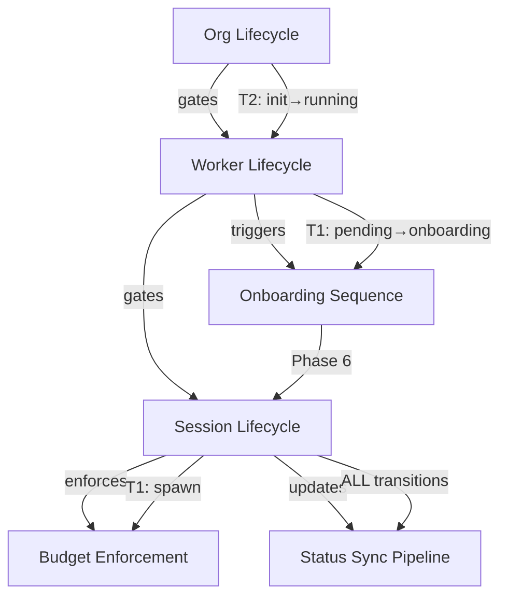
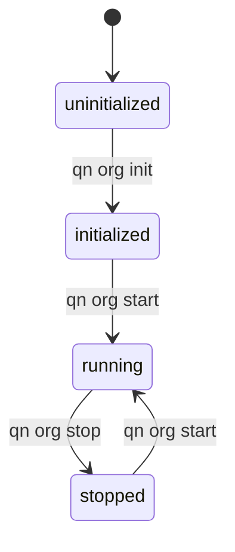
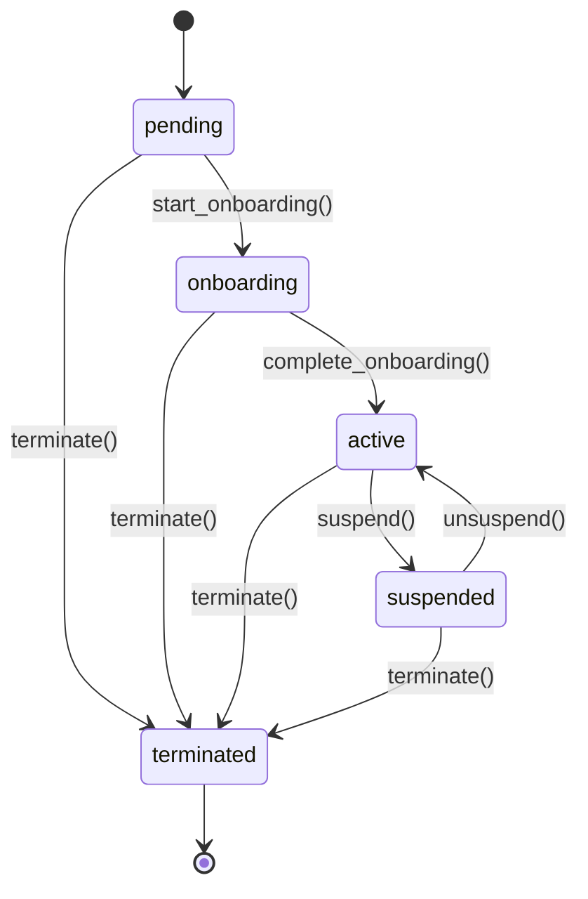
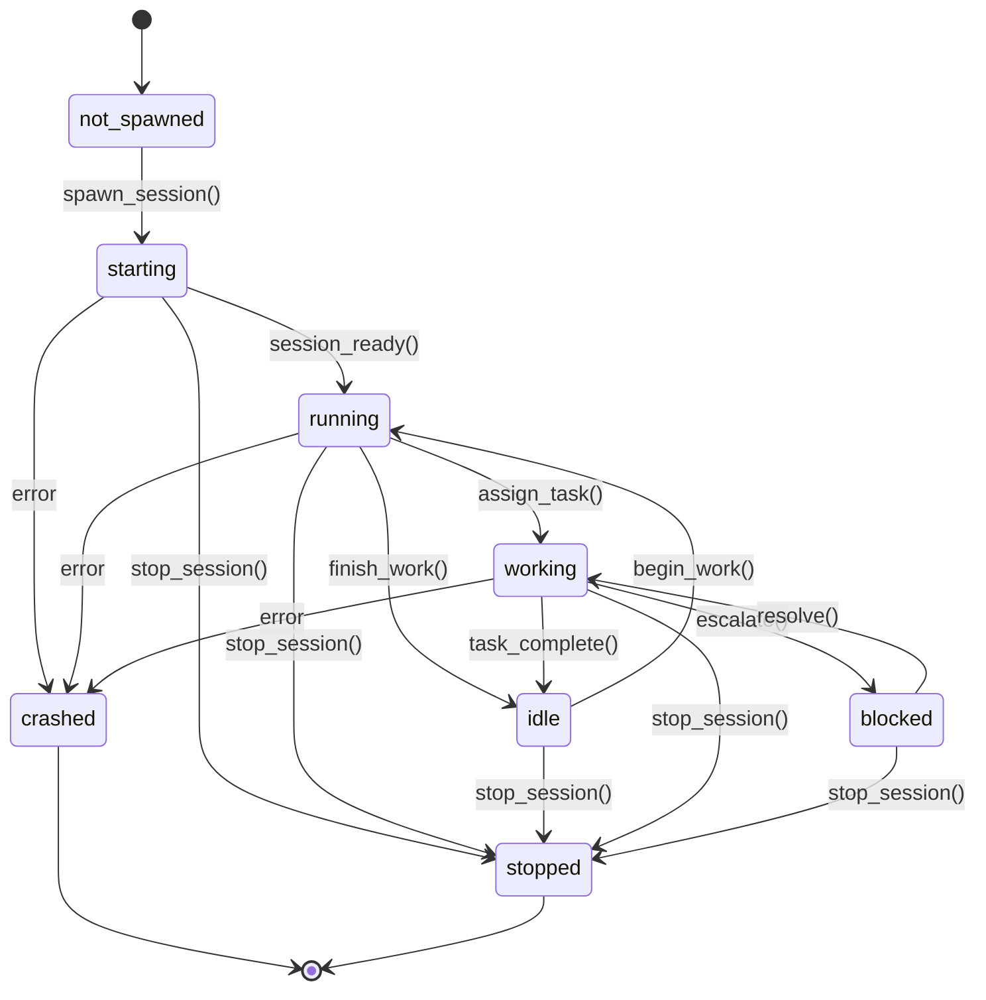
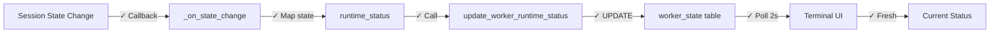
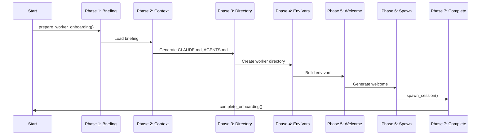
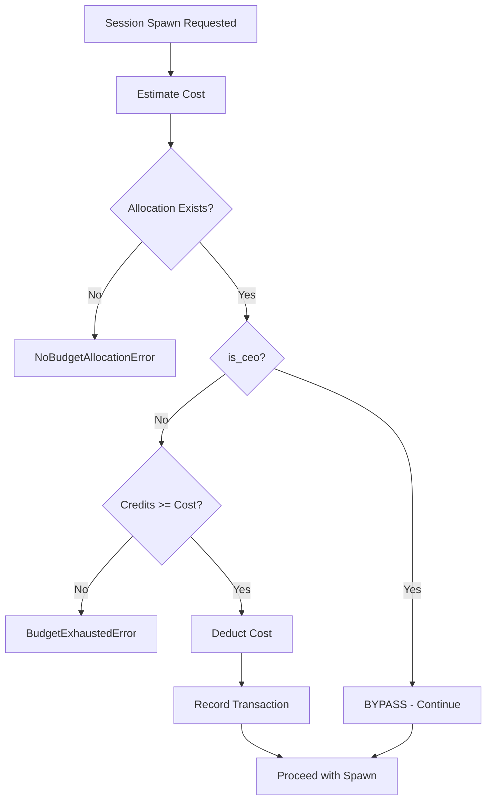

# QuinnAI State Machines

Comprehensive documentation of all state machines, workflows, and decision trees in the QuinnAI system.

## Overview

QuinnAI uses 6 interconnected state machines and workflows to manage the lifecycle of organizations, workers, and sessions. These state machines enforce invariants, gate operations, and ensure system consistency.

### Notation Guide

**Status Indicators:**
- `✅` Fully implemented and tested
- `⚠️` Partially implemented (incomplete or missing features)
- `❌` Not implemented or broken
- `🚧` In progress

**State Diagrams:**
- States: Rounded rectangles
- Transitions: Arrows with trigger labels
- Initial state: `[*] -->`
- Final state: `--> [*]`

**Transition Tables:**
| ID | From | To | Trigger | Preconditions | Actions | Postconditions | Errors |

### How to Use This Document

**For Developers:**
- Check state machine status before modifying lifecycle code
- Use transition tables to understand preconditions and postconditions
- Identify dependencies between machines

**For Debugging:**
- Trace actual system state through diagrams
- Check if transitions are valid
- Identify missing callbacks or updates

**For Design:**
- Understand invariants and gates
- Identify gaps and missing features
- Plan implementations

---

## State Machine Hierarchy



**Dependencies:**

1. **Org gates Worker**: Workers can only spawn sessions when org_status = 'running'
2. **Worker gates Session**: Sessions require worker lifecycle = 'active'
3. **Worker triggers Onboarding**: Worker transition to 'onboarding' starts onboarding sequence
4. **Session enforces Budget**: Session spawn (T1) checks budget before proceeding
5. **Session updates Status**: All session transitions should propagate to worker_state table

---

## Org Lifecycle State Machine

**Implementation:** `cli/core/org.py`
**Commands:** `qn org init`, `qn org start`, `qn org stop`
**Status:** ⚠️ Partial (no rollback, inconsistent resume)

### State Diagram



### States

| State | Description | Key Invariants |
|-------|-------------|----------------|
| uninitialized | Org directory exists, no database | No quinn.db file |
| initialized | Database created, CEO pending | CEO lifecycle = 'pending', budget allocated |
| running | Org operational | CEO lifecycle = 'active', sessions can spawn |
| stopped | Org paused | Sessions terminated, can resume |

### Transitions

#### T1: uninitialized → initialized

**Trigger:** `qn org init --ceo-name="Name" --budget=1000`
**Implementation:** `Org.init()` - `org.py:127`

**Preconditions:**
- Org directory exists
- No quinn.db file

**Actions:**
1. Create root team ("Executive")
2. Create CEO worker (no manager, high cost)
3. Add CEO to team_members
4. Create budget pool (30-day period)
5. Allocate budget to CEO (can_delegate=True)
6. Subscribe CEO to team channel
7. Create org-wide channels (general, board-channel)
8. Initialize beads database
9. Set org_status = 'initialized'

**Postconditions:**
- org_status = 'initialized'
- CEO exists, lifecycle = 'pending'
- Budget allocated
- Channels created

**Errors:** DatabaseError → Rollback, remove quinn.db

**Status:** ✅ Implemented

---

#### T2: initialized → running (first start)

**Trigger:** `qn org start`
**Implementation:** `Org.start()` - `org.py:223`

**Preconditions:**
- org_status = 'initialized'
- CEO worker exists
- Provider config valid

**Actions:**
1. Validate state transition
2. CEO.start_onboarding() → lifecycle = 'onboarding'
3. CEO.complete_onboarding() → lifecycle = 'active'
4. If config/ceo_briefing.md exists:
   - Create message in board-channel
   - Create notification bead (P0)
   - Skip if already delivered
5. Set org_status = 'running'
6. Update org-chart
7. If --spawn-ceo=True:
   - prepare_worker_onboarding()
   - generate_welcome_message()
   - spawn_session()

**Postconditions:**
- org_status = 'running'
- CEO lifecycle = 'active'
- CEO session spawned (if requested)

**Errors:**
- InvalidOrgTransition
- CEO activation fails → **INCONSISTENT STATE** (org running, CEO not active)
- Session spawn fails → **INCONSISTENT STATE** (org running, no CEO session)

**Rollback:** ❌ None implemented

**Status:** ⚠️ Partial (no rollback, leaves inconsistent state on failure)

---

#### T3: running → stopped

**Trigger:** `qn org stop [--force] [--no-cleanup]`
**Implementation:** `Org.stop()` - `org.py:351`

**Preconditions:**
- org_status = 'running'

**Actions:**
1. stop_all_sessions(db, force=force)
2. Validate state transition
3. Set org_status = 'stopped'
4. If --cleanup=True (default):
   - run_notification_cleanup()

**Postconditions:**
- org_status = 'stopped'
- Sessions stopped (best-effort)

**Errors:**
- Some sessions fail to stop → **Continues anyway**, shows warnings
- Cleanup fails → **Org already stopped**, no rollback

**Status:** ⚠️ Partial (no session stop verification)

---

#### T4: stopped → running (resume)

**Trigger:** `qn org start`
**Implementation:** `Org.start()` - `org.py:251`

**Preconditions:**
- org_status = 'stopped'

**Actions:**
1. Validate state transition
2. Set org_status = 'running'

**Postconditions:**
- org_status = 'running'
- CEO lifecycle unchanged (already 'active')
- **NO CEO SESSION SPAWNED**

**Errors:** InvalidOrgTransition

**Status:** ❌ Broken (inconsistent with T2, doesn't spawn CEO session)

---

### Invalid Transitions

| From | To | Error |
|------|----|-|
| initialized | stopped | Must start first |
| uninitialized | running | Must init first |
| running | uninitialized | Cannot un-init |
| stopped | initialized | Cannot re-init |

### Dependencies

**Triggers:**
- T2 (initialized → running): Triggers Worker lifecycle (CEO: pending → onboarding → active)
- T2: Triggers Onboarding Sequence (if spawning CEO)
- T3 (running → stopped): Requires all Sessions stop

**Gates:**
- Worker.spawn_session() requires org_status = 'running'

### Critical Gaps

1. **No rollback on T2 failure** - CEO activation or session spawn fails → inconsistent state
2. **No session health check** - T2 returns before verifying CEO session ready
3. **Inconsistent resume** - T4 doesn't spawn CEO session (different from T2)
4. **No session stop verification** - T3 updates status even if sessions fail to stop

### Implementation

**File:** `cli/core/org.py`
**State storage:** `org_state` table (status, ceo_worker_id, started_at, stopped_at)
**State validation:** Uses `ORG_TRANSITIONS` dict from `shared/__init__.py`
**Transition guard:** `_validate_transition()` checks valid moves

**Commands:**
- `cli/commands/org/init.py` → calls `Org.init()`
- `cli/commands/org/start.py` → calls `Org.start()`
- `cli/commands/org/stop.py` → calls `Org.stop()`

---

## Worker Lifecycle State Machine

**Implementation:** `cli/core/worker.py`
**Commands:** `qn org hire`, `qn org fire`, worker methods
**Status:** ✅ Implemented

### State Diagram



### States

| State | Description | can_work | Sessions Allowed |
|-------|-------------|----------|------------------|
| pending | Created, not onboarded | False | No |
| onboarding | Activation in progress | False | No |
| active | Fully operational | True | Yes |
| suspended | Temporarily inactive | False | No |
| terminated | Permanently removed | False | No |

### Transitions

#### T1: pending → onboarding

**Trigger:** `worker.start_onboarding()`
**Implementation:** `Worker.start_onboarding()` - `worker.py:~800`

**Preconditions:** lifecycle_status = 'pending'

**Actions:**
1. Validate lifecycle transition
2. Set lifecycle_status = 'onboarding'

**Postconditions:**
- lifecycle_status = 'onboarding'
- Onboarding Sequence can begin

**Status:** ✅ Implemented

---

#### T2: onboarding → active

**Trigger:** `worker.complete_onboarding()`
**Implementation:** `Worker.complete_onboarding()` - `worker.py:~850`

**Preconditions:**
- lifecycle_status = 'onboarding'
- Onboarding sequence completed

**Actions:**
1. Validate lifecycle transition
2. Set lifecycle_status = 'active'

**Postconditions:**
- lifecycle_status = 'active'
- can_work = True
- Sessions can be spawned

**Status:** ✅ Implemented

---

#### T3: active → suspended

**Trigger:** `worker.suspend(force=False)`
**Implementation:** `Worker.suspend()`

**Preconditions:**
- lifecycle_status = 'active'
- No active session OR force=True

**Actions:**
1. Validate lifecycle transition
2. Stop active session (if exists)
3. Set lifecycle_status = 'suspended'

**Postconditions:**
- lifecycle_status = 'suspended'
- can_work = False

**Status:** ✅ Implemented

---

#### T4: suspended → active

**Trigger:** `worker.unsuspend()`
**Implementation:** `Worker.unsuspend()`

**Preconditions:** lifecycle_status = 'suspended'

**Actions:**
1. Validate lifecycle transition
2. Set lifecycle_status = 'active'

**Postconditions:**
- lifecycle_status = 'active'
- can_work = True

**Status:** ✅ Implemented

---

#### T5: any → terminated

**Trigger:** `worker.terminate(force=True)` or `qn org fire <worker>`
**Implementation:** `Worker.terminate()`

**Preconditions:** Worker exists

**Actions:**
1. Stop active session (force=True)
2. Set lifecycle_status = 'terminated'

**Postconditions:**
- lifecycle_status = 'terminated'
- can_work = False
- Cannot spawn sessions
- Worker record remains (soft delete)

**Status:** ✅ Implemented

---

### Invalid Transitions

| From | To | Why |
|------|----|-|
| pending | active | Must onboard first |
| onboarding | suspended | Must complete onboarding |
| terminated | any | Permanent state |

### Dependencies

**Gates:**
- Session.spawn() requires worker lifecycle = 'active'

**Triggered by:**
- Org.start() (T2: initialized → running) triggers CEO: pending → onboarding → active

**Triggers:**
- T1 (pending → onboarding): Triggers Onboarding Sequence

### Implementation

**File:** `cli/core/worker.py`
**State storage:** `workers` table, column `status` (lifecycle_status)
**Transition validation:** `_validate_lifecycle_transition()` method
**State machine:** Uses `WORKER_TRANSITIONS` dict from `shared/worker.py`

**Query helpers:**
- `get_workers_by_lifecycle_status(db, status)` - Filter by lifecycle
- `worker.can_work` property - Derived from lifecycle_status

---

## Session Lifecycle State Machine

**Implementation:** `cli/core/worker.py`, `cli/core/sessions/*.py`
**Status:** ❌ Broken (manual transitions, no auto-propagation)

### State Diagram



### States

| State | Description | worker_state.runtime_status |
|-------|-------------|------------------------------|
| not_spawned | No session exists | NULL or 'stopped' |
| starting | Session spawn in progress | 'starting' |
| running | Session ready, can accept work | 'running' |
| idle | Session ready, no current task | 'idle' |
| working | Actively executing task | 'working' |
| blocked | Waiting on external dependency | 'blocked' |
| stopped | Cleanly terminated | 'stopped' |
| crashed | Abnormally terminated | 'crashed' |

### Transitions

#### T1: not_spawned → starting

**Trigger:** `worker.spawn_session(config)` or `qn org start --worker=name`
**Implementation:** `Worker.spawn_session()` - `worker.py:1163`

**Preconditions:**
- Worker lifecycle = 'active'
- No existing active session
- Budget available OR is_ceo=True

**Actions:**
1. Validate worker can spawn
2. Check worker_state for existing session → raises ActiveSessionExistsError
3. Estimate spawn cost (based on worker.cost tier)
4. Check budget allocation → raises NoBudgetAllocationError or BudgetExhaustedError
5. Create session via registry (adapter-specific)
6. **Update worker_state.runtime_status = 'starting'**
7. Update worker_state.pid (if available)
8. Record spend against budget
9. Create session record in sessions table

**Postconditions:**
- worker_state.runtime_status = 'starting'
- Session process spawning
- Budget deducted
- Session record created

**Errors:**
- ActiveSessionExistsError - Cannot spawn duplicate
- NoBudgetAllocationError - No allocation found
- BudgetExhaustedError - Insufficient credits
- Provider error - Session spawn failed

**Rollback:** ❌ None (budget deducted even if spawn fails)

**Status:** ⚠️ Partial (no rollback)

---

#### T2: starting → running

**Trigger:** `worker.session_ready()`
**Implementation:** `Worker.session_ready()` - `worker.py:1032`

**Preconditions:**
- worker_state.runtime_status = 'starting'
- Session adapter reports ready

**Actions:**
1. Validate runtime transition
2. **Update worker_state.runtime_status = 'running'**

**Postconditions:**
- worker_state.runtime_status = 'running'
- Session can accept tasks

**Status:** ❌ Broken (session adapter doesn't call this automatically)

---

#### T3: running ⇄ idle

**Trigger:** `worker.finish_work()` / `worker.begin_work()`
**Implementation:** `Worker.finish_work()`, `Worker.begin_work()`

**Actions (running → idle):**
1. Validate runtime transition
2. **Update worker_state.runtime_status = 'idle'**
3. Clear worker_state.current_task_id

**Actions (idle → running):**
1. Validate runtime transition
2. **Update worker_state.runtime_status = 'running'**

**Status:** ❌ Broken (manual calls only, no automatic triggers)

---

#### T4: running → working

**Trigger:** Task assignment
**Implementation:** Manual update

**Actions:**
1. **Update worker_state.runtime_status = 'working'**
2. Set worker_state.current_task_id

**Status:** ❌ Broken (manual, not called by task system)

---

#### T5: working → blocked

**Trigger:** Escalation or wait for resource
**Implementation:** Manual update

**Actions:**
1. **Update worker_state.runtime_status = 'blocked'**
2. Record blocking reason

**Status:** ❌ Broken (manual)

---

#### T6: blocked → working

**Trigger:** Issue resolved
**Implementation:** Manual update

**Actions:**
1. **Update worker_state.runtime_status = 'working'**

**Status:** ❌ Broken (manual)

---

#### T7: any → stopped

**Trigger:** `worker.stop_session(force=False)` or `qn org stop --worker=name`
**Implementation:** `Worker.stop_session()` - `worker.py:~1100`

**Preconditions:** Session exists

**Actions:**
1. Gracefully stop session (signal handler, cleanup)
2. **Update worker_state.runtime_status = 'stopped'**
3. Clear worker_state.pid
4. Update sessions table: state = 'stopped'

**Postconditions:**
- worker_state.runtime_status = 'stopped'
- Session process terminated

**Status:** ✅ Implemented

---

#### T8: any → crashed

**Trigger:** Session error, timeout, or kill
**Implementation:** `Worker.crash_session()`

**Preconditions:** Session encounters fatal error

**Actions:**
1. Detect crash (process exit, exception, timeout)
2. **Update worker_state.runtime_status = 'crashed'**
3. Clear worker_state.pid
4. Update sessions table: state = 'crashed'
5. Log error details

**Postconditions:**
- worker_state.runtime_status = 'crashed'
- Error logged

**Status:** ❌ Broken (crash detection may not trigger this)

---

### Invalid Transitions

| From | To | Error |
|------|----|-|
| not_spawned | running | Must start first |
| working | starting | Session already running |

### Dependencies

**Requires:**
- Worker lifecycle = 'active' (T1 precondition)
- Budget Enforcement passes (T1)

**Updates:**
- worker_state.runtime_status (ALL transitions)
- Status Sync pipeline (should trigger on ALL transitions)

### Critical Issue: No Automatic Propagation

**Problem:** Session adapters change state internally but DON'T call Worker methods.

**Current flow:**
```
Session State Change (in adapter)
    ↓
  ❌ NO CALLBACK
    ↓
Worker methods NOT called
    ↓
worker_state table NOT updated
    ↓
UI shows stale data
```

**Required flow:**
```
Session State Change (in adapter)
    ↓
  ✓ Callback: _on_state_change(old, new)
    ↓
  ✓ Map session state → runtime_status
    ↓
  ✓ update_worker_runtime_status(db, worker_id, status)
    ↓
worker_state table UPDATED
```

**Fix:** Session adapters need callbacks in:
- `cli/core/sessions/claude_code.py`
- `cli/core/sessions/gemini.py`
- Base session class in `cli/core/sessions/__init__.py`

### Implementation

**State storage:**
- `worker_state` table: runtime_status, current_task_id, pid
- `sessions` table: state, worker_id, started_at, stopped_at

**Transition methods:**
- `Worker.spawn_session()` - T1
- `Worker.session_ready()` - T2 (NOT CALLED AUTOMATICALLY)
- `Worker.begin_work()` / `Worker.finish_work()` - T3 (MANUAL)
- `Worker.stop_session()` - T7
- `Worker.crash_session()` - T8 (MAY NOT BE CALLED)

**Query helper:**
- `update_worker_runtime_status(db, worker_id, status)` - Direct DB update

**Session Adapters:**
- `cli/core/sessions/claude_code.py` - Claude Code sessions
- `cli/core/sessions/gemini.py` - Gemini sessions
- Base class defines `_on_state_change()` but implementations don't call Worker methods

---

## Status Sync Propagation

**Type:** Data propagation pipeline
**Purpose:** Session state → Database → UI
**Status:** ❌ Broken (no automatic propagation)

### Current Flow (Broken)


**Problem:** Sessions change state internally, Worker methods never called, database never updated.

---

### Desired Flow



**Solution:** Callbacks + auto-refresh

---

### Components

#### 1. Session Adapter State Change

**Location:** `cli/core/sessions/claude_code.py`, `cli/core/sessions/gemini.py`

**Current:**
```python
def _on_state_change(self, old_state, new_state):
    # Callback exists but does nothing with Worker
    self._state = new_state
    # ❌ NO database update
```

**Required:**
```python
def _on_state_change(self, old_state, new_state):
    self._state = new_state

    # Map session state to worker runtime_status
    runtime_status = self._map_state(new_state)

    # Update database
    update_worker_runtime_status(
        self._db,
        self._worker_id,
        runtime_status
    )
```

**State Mapping:**
| Session State | runtime_status |
|---------------|----------------|
| starting | starting |
| running | running |
| idle | idle |
| stopped | stopped |
| crashed | crashed |
| error | crashed |

---

#### 2. Worker State Update

**Location:** `cli/core/queries.py:677`

**Current:**
```python
def update_worker_runtime_status(
    db: Database,
    worker_id: str,
    runtime_status: str,
    current_task_id: Optional[str] = None,
) -> None:
    now = datetime.now()
    db.execute(
        """UPDATE worker_state SET runtime_status = ?, current_task_id = ?,
           last_activity = ?, updated_at = ? WHERE worker_id = ?""",
        (runtime_status, current_task_id, now, now, worker_id)
    )
    db.connection.commit()
```

**Status:** ✅ Works (direct database UPDATE)

**Issue:** Multiple code paths call this, potential race conditions

---

#### 3. Worker Cache Invalidation

**Location:** `cli/core/worker.py:600`

**Current:**
```python
@property
def runtime_status(self) -> Optional[str]:
    if self._state_data is None:
        self._load_state()
    return self._state_data.runtime_status if self._state_data else None
```

**Problem:** Caches `_state_data` after first load, returns stale data

**Fix:**
```python
@property
def runtime_status(self) -> Optional[str]:
    # ALWAYS reload for runtime status (frequently changing)
    self._load_state()
    return self._state_data.runtime_status if self._state_data else None
```

---

#### 4. UI Auto-Refresh

**Location:** `terminal-app/src/board_ui/views/team.py:76`

**Current:**
```python
async def on_mount(self) -> None:
    await self.refresh_workers()
    # ❌ No periodic refresh
```

**Fix:**
```python
async def on_mount(self) -> None:
    await self.refresh_workers()

    # Auto-refresh every 2 seconds
    self.set_interval(2.0, self.refresh_workers)
```

**Also fix:** `terminal-app/src/board_ui/views/dashboard.py` (CEO status)

---

### Latency Requirements

| Step | Target | Current |
|------|--------|---------|
| Session change → Database | < 500ms | ∞ (never) |
| Database → UI poll | < 2s | ∞ (manual) |
| Total end-to-end | < 2.5s | ∞ (never) |

---

### Consistency Model

**Current:** No consistency
- Session state and worker_state are independent
- Can diverge indefinitely
- No detection of inconsistency

**Desired:** Eventually consistent
- All session state changes propagate to worker_state
- UI reflects database state within 2 seconds
- Stale data automatically replaced

---

### Data Sources

#### Primary: worker_state Table

```sql
CREATE TABLE worker_state (
    worker_id TEXT PRIMARY KEY,
    runtime_status TEXT,
    current_task_id TEXT,
    pid INTEGER,
    last_activity TIMESTAMP,
    updated_at TIMESTAMP,
    tasks_completed INTEGER,
    tasks_failed INTEGER
)
```

**Authoritative for:** runtime_status, current_task_id
**Updated by:** update_worker_runtime_status()
**Read by:** Terminal UI, CLI commands

---

#### Secondary: sessions Table

```sql
CREATE TABLE sessions (
    id TEXT PRIMARY KEY,
    worker_id TEXT,
    state TEXT,
    started_at TIMESTAMP,
    stopped_at TIMESTAMP,
    pid INTEGER
)
```

**Authoritative for:** Session lifecycle history
**Not used for:** Real-time status display

---

### Implementation Files

**Session Adapters:**
- `cli/core/sessions/claude_code.py` - Add callback
- `cli/core/sessions/gemini.py` - Add callback
- `cli/core/sessions/__init__.py` - Base session class

**Worker:**
- `cli/core/worker.py` - Fix cache invalidation (line 600)

**Terminal UI:**
- `terminal-app/src/board_ui/views/team.py` - Add auto-refresh (line 72)
- `terminal-app/src/board_ui/views/dashboard.py` - Add auto-refresh

**Queries:**
- `cli/core/queries.py` - Already works (line 677)

---

### Race Conditions

#### Concurrent Updates

**Scenario:**
1. Session A changes state → Update runtime_status = 'running'
2. Session B (same worker) changes state → Update runtime_status = 'crashed'
3. Order non-deterministic → final state unpredictable

**Solution:** Database-level constraint
```sql
-- Only one active session per worker
CREATE UNIQUE INDEX idx_active_session ON sessions(worker_id)
WHERE state IN ('starting', 'running', 'idle', 'working', 'blocked');
```

**Enforced at:** Session spawn (raises ActiveSessionExistsError)

---

### Heartbeat System

**Purpose:** Detect crashed sessions that didn't trigger crash callback

**Implementation:** `cli/core/queries.py:684`

```python
def record_worker_heartbeat(db: Database, worker_id: str) -> None:
    now = datetime.now()
    db.execute(
        "UPDATE worker_state SET last_activity = ?, updated_at = ? WHERE worker_id = ?",
        (now, now, worker_id)
    )
    db.connection.commit()
```

**Trigger:** Session adapters should call every 30 seconds

**Stale Detection:**
```python
# If last_activity > 60 seconds and runtime_status = 'running'
# Auto-transition to 'crashed'
```

**Status:** ⚠️ Function exists but not called by sessions

---

### Test Scenarios

| Scenario | Expected | Current |
|----------|----------|---------|
| Session starts | UI shows 'starting' < 2.5s | ❌ Never updates |
| Session ready | UI shows 'running' < 2.5s | ❌ Never updates |
| Session crashes | UI shows 'crashed' < 2.5s | ❌ Never updates |
| Navigate away/back | UI shows fresh data | ⚠️ Shows stale cached data |
| 100 rapid changes | UI eventually consistent | ❌ No updates at all |

---

## Onboarding Sequence

**Type:** Sequential workflow within Worker 'onboarding' lifecycle state
**Implementation:** `cli/core/onboarding.py`
**Status:** ⚠️ Partial (works but no error recovery, no checkpointing)

### Sequence



### Phases

| Phase | Function | Inputs | Outputs | Idempotent |
|-------|----------|--------|---------|------------|
| 1 | Briefing Prep | worker_id, org_path | briefing_content or None | Yes |
| 2 | Context Gen | worker_data, org_structure | CLAUDE.md, AGENTS.md, README.md | Yes |
| 3 | Directory Setup | org_path, worker_id | storage/workers/{id}/ | Yes |
| 4 | Env Vars | context, org_path | Dict of env vars | Yes |
| 5 | Welcome Msg | context, worker_dir | Welcome string | Yes |
| 6 | Session Spawn | worker, SessionConfig | Active session | **No** |
| 7 | Complete | worker_id | lifecycle = 'active' | Yes |

### Phase Details

#### Phase 1: Briefing Preparation

**Implementation:** `prepare_worker_onboarding()` - `onboarding.py`

**Actions:**
1. Load worker data from database
2. Check if config/{role}_briefing.md exists
3. Read briefing content if exists

**Output:** `OnboardingContext` with briefing_content or None

**Retry:** Safe (read-only)

---

#### Phase 2: Context Generation

**Implementation:** `prepare_worker_onboarding()` - `onboarding.py`

**Actions:**
1. Generate CLAUDE.md (role-specific instructions)
2. Generate AGENTS.md (team hierarchy, escalation paths)
3. Generate README.md (worker overview)
4. Write files to shared/onboarding/configs/

**Output:** Context files in shared/onboarding/configs/

**Retry:** Safe (overwrites existing files)

---

#### Phase 3: Directory Setup

**Implementation:** `prepare_worker_onboarding()` - `onboarding.py`

**Actions:**
1. Create storage/workers/{worker_id}/
2. Copy CLAUDE.md, AGENTS.md, README.md to worker dir

**Output:** Worker directory ready with context files

**Retry:** Safe (mkdir -p, copy overwrites)

---

#### Phase 4: Environment Variables

**Implementation:** `get_worker_env_vars()` - `onboarding.py`

**Actions:**
1. Build env var dict:
   - WORKER_ID
   - WORKER_NAME
   - WORKER_ROLE
   - BRIEFING_PATH (if briefing exists)
   - ORG_PATH
   - WORKER_DIR

**Output:** Dict of environment variables

**Retry:** Safe (pure function)

---

#### Phase 5: Welcome Message

**Implementation:** `generate_welcome_message()` or `generate_returning_message()` - `onboarding.py`

**Actions:**
1. Check if first-time or returning (based on session history)
2. Generate appropriate welcome message
3. Include briefing reference if first-time

**Output:** Welcome message string

**Retry:** Safe (pure function)

---

#### Phase 6: Session Spawn

**Implementation:** `worker.spawn(config)` → `Worker.spawn_session()`

**Actions:**
1. Create session via registry (adapter-specific)
2. Attach session to worker
3. Start session process
4. **Deduct budget**
5. **Create session record**

**Output:** Active session

**Retry:** ❌ NOT SAFE
- Spawns process
- Deducts budget
- Check for existing session first

---

#### Phase 7: Completion

**Implementation:** `worker.complete_onboarding()` - `worker.py`

**Actions:**
1. Validate lifecycle transition (onboarding → active)
2. Update worker lifecycle_status = 'active'

**Output:** Worker ready for work

**Retry:** Safe (idempotent state update)

---

### CEO Special Case

During org start (Org: initialized → running), CEO onboarding includes additional steps:

**After Phase 7:**
1. Check if config/ceo_briefing.md exists
2. If exists and not already delivered:
   - Create message in board-channel
   - Create P0 notification bead for CEO
   - Message content: briefing markdown

**Implementation:** `Org._deliver_ceo_briefing()` - `org.py:268`

**Idempotent:** Yes (checks for existing message)

---

### Error Handling

#### Phases 1-5: Retryable
- All read-only or idempotent file operations
- Safe to restart from Phase 1

#### Phase 6: NOT Retryable
- Spawns process
- Deducts budget
- Must check for existing session before retry

#### Phase 7: Retryable
- Idempotent state update

#### Rollback Strategy

**Current:** ❌ No rollback
- If Phase 6 fails: Budget deducted, no session spawned
- If Phase 7 fails: Worker stuck in 'onboarding' state, session running

**Desired:**
- Transaction wrapping budget + spawn
- Rollback budget if spawn fails
- Kill spawned process if completion fails

---

### Checkpointing

**Current:** ❌ No checkpoints
- Must restart from Phase 1 on failure

**Desired:**
- Checkpoint after each phase
- Resume from last successful phase
- Store checkpoint in worker_state table

**Checkpoint data:**
```sql
ALTER TABLE worker_state ADD COLUMN onboarding_checkpoint TEXT;
-- Values: 'briefing_prepared', 'context_generated', etc.
```

---

### Implementation

**Main function:** `prepare_worker_onboarding(db, worker_id, org_path)` - Phases 1-5
**Trigger:** Called by `Org.start()` or `qn org start --worker=name`

**Directory structure created:**
```
storage/workers/{worker_id}/
    ├── CLAUDE.md
    ├── AGENTS.md
    └── README.md
```

**Context artifacts:**
```
shared/onboarding/configs/
    ├── CLAUDE.md (templates)
    ├── AGENTS.md (templates)
    └── README.md (templates)
```

---

## Budget Enforcement

**Type:** Decision tree within Session spawn (T1)
**Implementation:** `cli/core/worker.py` - `Worker.spawn_session()`
**Status:** ⚠️ Partial (no rollback on spawn failure)

### Decision Flow



### Cost Estimation

**Algorithm:** Based on `worker.cost` tier from workers table

```python
if worker.cost <= 10:
    spawn_cost = 1.0      # Low tier
elif worker.cost <= 50:
    spawn_cost = 5.0      # Medium tier
else:
    spawn_cost = 10.0     # High tier (CEO)
```

**Implementation:** `Worker.spawn_session()` - `worker.py:1229`

---

### Budget Check

#### Query: Get Allocation

```sql
SELECT id, allocated_credits, spent_credits, can_delegate
FROM budget_allocations
WHERE worker_id = ? AND period_end > NOW()
ORDER BY period_end ASC
LIMIT 1
```

**Raises:** `NoBudgetAllocationError` if no active allocation found

---

#### Query: Check Availability

```python
remaining = allocated_credits - spent_credits

if remaining < spawn_cost:
    raise BudgetExhaustedError(
        worker_id=worker_id,
        required=spawn_cost,
        available=remaining
    )
```

---

#### CEO Bypass

```python
if worker.role == 'CEO':
    # Skip all budget checks
    # Proceed directly to spawn
    pass
```

**Rationale:** CEO has unlimited budget authority

---

### Budget Deduction

#### Update Allocation

```sql
UPDATE budget_allocations
SET spent_credits = spent_credits + ?
WHERE id = ? AND period_end > NOW()
```

**Atomic:** Yes (single UPDATE statement)

---

#### Record Transaction

```sql
INSERT INTO budget_transactions (
    id,
    allocation_id,
    amount,
    transaction_type,
    description,
    created_at
) VALUES (?, ?, ?, 'debit', 'Session spawn', NOW())
```

**Purpose:** Audit trail of all budget operations

---

### Rollback Strategy

#### Current Behavior

**Problem:** If session spawn fails AFTER budget deduction:
- Budget is deducted
- No session spawned
- Budget NOT refunded

**Example failure:**
1. Deduct 5.0 credits ✅
2. Record transaction ✅
3. Spawn session → **FAILS** ❌
4. Result: -5.0 credits, no session

#### Desired Behavior

**Solution:** Transaction wrapping budget + spawn

```python
with db.transaction():
    # 1. Deduct budget
    deduct_budget(worker_id, cost)

    try:
        # 2. Spawn session
        session = spawn_session_process(config)
    except Exception:
        # Transaction rollback on exception
        # Budget automatically refunded
        raise

    # 3. Commit if both succeed
```

**Status:** ❌ Not implemented (no transaction wrapping)

---

### Budget Delegation

#### Manager Allocation to Reports

**Feature:** Managers can allocate portion of their budget to direct reports

**Table:** `budget_delegations`
```sql
CREATE TABLE budget_delegations (
    id TEXT PRIMARY KEY,
    from_allocation_id TEXT,  -- Manager's allocation
    to_worker_id TEXT,         -- Report
    delegated_amount REAL,
    created_at TIMESTAMP
)
```

#### Constraints

**From allocation:**
- `can_delegate = True` (must have delegation permission)
- `delegation_limit` - Max amount delegatable per subordinate
- Remaining: `allocated_credits - spent_credits - sum(delegated_amount)`

**Example:**
```
Manager allocation: 100.0 credits
delegation_limit: 50.0
Spent: 20.0
Delegated to Report A: 30.0
Remaining available: 50.0 (100 - 20 - 30)
Can delegate to Report B: max 20.0 (limited by 50.0 cap)
```

---

### Error Cases

| Error | Condition | Recovery |
|-------|-----------|----------|
| NoBudgetAllocationError | No active allocation | Admin must create allocation |
| BudgetExhaustedError | remaining < cost | Wait for new period or request delegation |
| AllocationExpiredError | period_end < NOW | Budget admin renews allocation |

---

### Implementation

**Primary file:** `cli/core/worker.py` - `Worker.spawn_session()` lines 1229-1258

**Budget tables:**
- `budget_pools` - Org-wide budget pools
- `budget_allocations` - Worker-specific allocations
- `budget_transactions` - Audit log of all operations
- `budget_delegations` - Manager → Report delegations

**Query helpers:**
- `get_budget_allocation(db, worker_id)` - Get active allocation
- `deduct_budget(db, allocation_id, amount)` - Deduct + record
- `get_budget_remaining(db, worker_id)` - Calculate remaining credits

**Constants:**
- `DEFAULT_CEO_COST = 100.0` - CEO worker cost tier
- Budget periods: 30 days (configurable in org init)

---

## Cross-Machine Validation Rules

### Invariant Checks

**I1: Org gates Worker**
```python
# Worker can only spawn session if org is running
assert org.status == 'running' or raise InvalidOrgStateError
```
**Violated by:** Org stop without session cleanup
**Enforced at:** `Worker.spawn_session()` precondition check

---

**I2: Worker gates Session**
```python
# Session can only spawn if worker is active
assert worker.lifecycle_status == 'active' or raise WorkerNotActiveError
```
**Violated by:** Worker suspension without session stop
**Enforced at:** `Worker.spawn_session()` precondition check

---

**I3: One active session per worker**
```python
# Worker can have at most one active session
active_sessions = [s for s in sessions if s.state in ACTIVE_STATES]
assert len(active_sessions) <= 1 or raise ActiveSessionExistsError
```
**Violated by:** Concurrent spawn attempts
**Enforced at:** Database unique constraint + `Worker.spawn_session()` check

---

**I4: Budget deduction matches session spawn**
```python
# Budget is deducted if and only if session spawned
if session.exists():
    assert transaction.exists() with transaction.amount == spawn_cost
```
**Violated by:** Spawn failure after budget deduction
**Fixed by:** Transaction wrapping (not implemented)

---

**I5: worker_state.runtime_status reflects session state**
```python
# Database status must match actual session state
assert worker_state.runtime_status == session.current_state or stale_data
```
**Violated by:** Session state changes without callback
**Fixed by:** Status Sync callbacks (not implemented)

---

### Dependency Validation

**D1: Org start requires CEO activation**
```python
# After Org T2 (initialized → running), CEO must be active
if org.status == 'running':
    assert ceo.lifecycle_status == 'active'
```
**Violated by:** CEO activation failure without rollback
**Missing:** Rollback on T2 failure

---

**D2: Worker onboarding requires session spawn**
```python
# Onboarding Phase 6 must complete before Phase 7
if worker.lifecycle_status == 'active':
    assert onboarding_sequence.completed_phases >= 7
```
**Violated by:** Skipping Phase 6 or failure without rollback
**Missing:** Checkpointing

---

**D3: Session spawn requires budget check**
```python
# T1 must pass budget enforcement before spawning
before_spawn():
    assert budget_enforcement.passed or worker.is_ceo
```
**Violated by:** Budget bypass for non-CEO workers
**Enforced at:** `Worker.spawn_session()` budget check

---

### Consistency Checks

**C1: Org state consistency after resume**
```python
# T4 (stopped → running) should behave like T2
after_org_resume():
    if previous_state_had_ceo_session:
        assert ceo.has_active_session or INCONSISTENT
```
**Violated by:** T4 doesn't spawn CEO session
**Status:** ❌ Broken

---

**C2: Worker state consistency after suspend/unsuspend**
```python
# T3 (active → suspended) must stop sessions
after_worker_suspend():
    assert not worker.has_active_session
```
**Enforced at:** `Worker.suspend()` stops session
**Status:** ✅ Implemented

---

**C3: Session state propagation consistency**
```python
# All session state changes propagate to worker_state
on_session_state_change(old, new):
    assert update_worker_runtime_status.called
    assert worker_state.runtime_status == map_state(new)
```
**Violated by:** Missing callbacks in session adapters
**Status:** ❌ Broken

---

## Implementation Checklist

### Critical Fixes (P0)

- [ ] **Status Sync callbacks** - Session adapters must call Worker methods
  - [ ] `cli/core/sessions/claude_code.py` - Add `_on_state_change()` callback
  - [ ] `cli/core/sessions/gemini.py` - Add `_on_state_change()` callback
  - [ ] `cli/core/sessions/__init__.py` - Update base class
  - [ ] Test: Session state changes propagate to database < 500ms

- [ ] **Budget rollback** - Session spawn failures must refund budget
  - [ ] Wrap budget + spawn in transaction (`cli/core/worker.py:1229`)
  - [ ] Test: Spawn failure refunds budget

- [ ] **Org start rollback** - CEO activation failures must rollback org state
  - [ ] Transaction wrap CEO activation (`cli/core/org.py:223`)
  - [ ] Test: CEO activation failure leaves org in 'initialized' state

- [ ] **Org resume consistency** - T4 should spawn CEO session like T2
  - [ ] Update `Org.start()` resume path to match first-start behavior
  - [ ] Test: Resume spawns CEO session if --spawn-ceo=True

### High Priority (P1)

- [ ] **UI auto-refresh** - Terminal app must poll database every 2s
  - [ ] `terminal-app/src/board_ui/views/team.py:76` - Add `set_interval(2.0)`
  - [ ] `terminal-app/src/board_ui/views/dashboard.py` - Add auto-refresh
  - [ ] Test: Status changes appear in UI < 2.5s

- [ ] **Worker cache invalidation** - Runtime status must always reload
  - [ ] `cli/core/worker.py:600` - Remove cache for `runtime_status` property
  - [ ] Test: Cached Worker instances show fresh status

- [ ] **Session health check** - Org start must verify CEO session ready
  - [ ] Wait for session ready signal before returning from `Org.start()`
  - [ ] Test: `qn org start --spawn-ceo=True` verifies session running

- [ ] **Onboarding checkpointing** - Resume from last successful phase
  - [ ] Add `onboarding_checkpoint` column to `worker_state` table
  - [ ] Update phases to write checkpoint after completion
  - [ ] Test: Phase 6 failure allows resume from Phase 5

### Medium Priority (P2)

- [ ] **Session heartbeat** - Detect crashed sessions
  - [ ] Session adapters call `record_worker_heartbeat()` every 30s
  - [ ] Background task detects stale heartbeats → auto-crash
  - [ ] Test: Killed session transitions to 'crashed' within 60s

- [ ] **Session stop verification** - Org stop must verify sessions stopped
  - [ ] `Org.stop()` waits for session termination or timeout
  - [ ] Return error if any sessions fail to stop
  - [ ] Test: Hung session causes `qn org stop` to fail (unless --force)

- [ ] **Race condition prevention** - Database constraints for active sessions
  - [ ] Create unique index on sessions(worker_id) WHERE state IN (active states)
  - [ ] Test: Concurrent spawn attempts raise ActiveSessionExistsError

### Documentation (P3)

- [x] **State machine documentation** - This file
- [ ] **API documentation** - Document all transition methods
- [ ] **Error recovery guide** - How to recover from inconsistent states
- [ ] **Testing guide** - How to validate state machines

---

## Validation Tests

All state machine implementations must pass these tests:

### Org Lifecycle Tests

```python
def test_org_t2_rollback_on_ceo_failure():
    """T2 must rollback org state if CEO activation fails"""
    org.start()  # Should fail
    assert org.status == 'initialized'
    assert ceo.lifecycle_status == 'pending'

def test_org_t4_spawns_ceo_session():
    """T4 (resume) must spawn CEO session like T2"""
    org.stop()
    org.start(spawn_ceo=True)
    assert ceo.has_active_session

def test_org_t3_verifies_sessions_stopped():
    """T3 must verify all sessions stopped"""
    worker.spawn_session()
    worker.make_session_hang()
    result = org.stop()
    assert not result.success or force=True
```

### Worker Lifecycle Tests

```python
def test_worker_t1_triggers_onboarding():
    """T1 must trigger onboarding sequence"""
    worker.start_onboarding()
    assert worker.lifecycle_status == 'onboarding'
    assert onboarding_context_exists

def test_worker_t3_stops_session():
    """T3 must stop active session"""
    worker.spawn_session()
    worker.suspend()
    assert not worker.has_active_session
```

### Session Lifecycle Tests

```python
def test_session_t1_enforces_budget():
    """T1 must check budget before spawning"""
    worker.exhaust_budget()
    with pytest.raises(BudgetExhaustedError):
        worker.spawn_session()

def test_session_t1_rollback_on_spawn_failure():
    """T1 must refund budget if spawn fails"""
    initial_budget = worker.remaining_budget
    with mock.patch('spawn_process', side_effect=Exception):
        with pytest.raises(Exception):
            worker.spawn_session()
    assert worker.remaining_budget == initial_budget

def test_session_t2_automatic_callback():
    """T2 must be called automatically when session ready"""
    worker.spawn_session()
    wait_for(lambda: worker.runtime_status == 'running', timeout=5)
    assert worker_state.runtime_status == 'running'
```

### Status Sync Tests

```python
def test_status_sync_propagation_latency():
    """Status changes must propagate to database < 500ms"""
    start = time.time()
    session.change_state('running')
    elapsed = time.time() - start
    assert worker_state.runtime_status == 'running'
    assert elapsed < 0.5

def test_status_sync_ui_latency():
    """UI must show status changes < 2.5s"""
    session.change_state('crashed')
    wait_for(lambda: ui.shows_status('crashed'), timeout=2.5)
    assert ui.shows_status('crashed')

def test_status_sync_cache_invalidation():
    """Worker instances must reload runtime_status"""
    worker1 = Worker.load(worker_id)
    worker2 = Worker.load(worker_id)
    worker1.session.change_state('crashed')
    assert worker2.runtime_status == 'crashed'  # No stale cache
```

### Onboarding Tests

```python
def test_onboarding_phase6_not_idempotent():
    """Phase 6 must not spawn duplicate sessions"""
    onboarding.run_phases(1, 5)
    onboarding.run_phase(6)
    with pytest.raises(ActiveSessionExistsError):
        onboarding.run_phase(6)  # Retry fails

def test_onboarding_checkpoint_resume():
    """Onboarding must resume from last checkpoint"""
    onboarding.run_phases(1, 5)
    onboarding.fail_phase(6)
    onboarding.resume()
    assert onboarding.current_phase == 6  # Doesn't restart from 1
```

### Budget Enforcement Tests

```python
def test_budget_ceo_bypass():
    """CEO must bypass budget checks"""
    ceo.exhaust_budget()
    ceo.spawn_session()  # Should succeed despite no budget
    assert ceo.has_active_session

def test_budget_transaction_wrapping():
    """Budget deduction must rollback on spawn failure"""
    initial = worker.remaining_budget
    with mock.patch('spawn_process', side_effect=Exception):
        with pytest.raises(Exception):
            worker.spawn_session()
    assert worker.remaining_budget == initial
    assert len(budget_transactions) == 0  # No transaction recorded
```

---

**Document Version:** 1.0
**Last Updated:** 2026-01-25
**Status:** Complete
