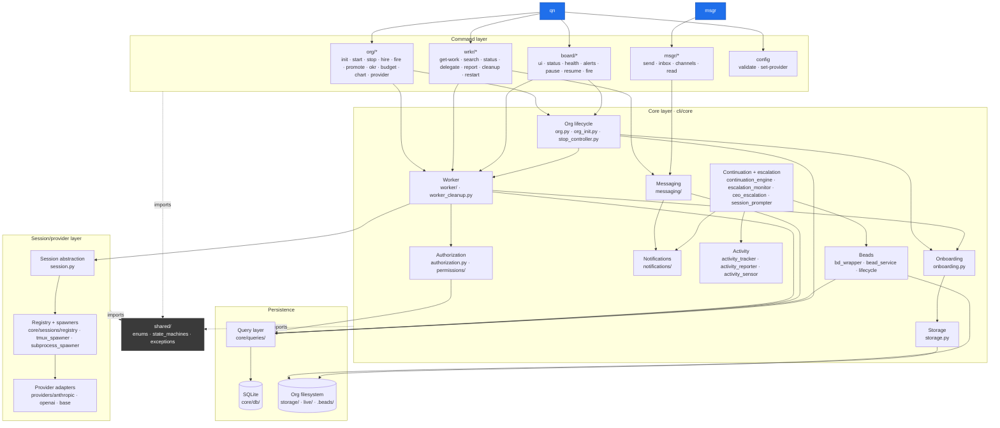

# QuinnAI CLI

Command-line interface for managing hierarchical AI organizations.

QuinnAI is the **platform** — the system on which AI organizations run. It is provider-agnostic: any CLI-based AI agent (Claude Code, Codex, Gemini, etc.) can be the brain of any worker. Workers are organized into hierarchies (CEO → managers → individual contributors), allocated budget, given storage, tracked via beads, and supervised by a "board" of human operators.

This README documents the CLI surface and the architecture behind it. For project-wide rules and conventions, see the repository [`CLAUDE.md`](../CLAUDE.md).

---

## Installation

```bash
# From the repo root, in a virtualenv:
pip install -r requirements-dev.txt
```

This installs `cli/` and `shared/` in editable mode and pulls in dev dependencies (`pytest`, `pytest-cov`, `systemeval`).

After install you have two entry points on `PATH`:

- `qn` — operator/worker control plane
- `msgr` — worker-facing messaging client

---

## Core concepts

| Concept | Definition |
|---|---|
| **Org** | An organization living under a single directory (`~/orgs/<name>/`). Has lifecycle `UNINITIALIZED → INITIALIZED → RUNNING ⇄ STOPPED`. |
| **Worker** | An AI agent bound to a CLI session. Two independent state machines: lifecycle (`pending → onboarding → active → offboarding → terminated`) and runtime (`starting → running ⇄ idle → stopped/crashed`). |
| **Session** | The 1:1 process backing a worker (tmux + a CLI like `claude`, `codex`, `gemini`). Spawned via a provider adapter. |
| **Provider** | A pluggable adapter that knows how to spawn and monitor a specific CLI agent. Selected by config, never hardcoded. |
| **Storage** | Hierarchical filesystem layout that mirrors the org-chart. Worker dir is at `storage/workers/<chain-of-managers>/<worker-id>/`. Shared dir is at `storage/shared/<topic>/`. |
| **Beads** | Org-scoped issue tracker invoked through `bd`. The CLI sets `BEADS_DIR` per org and validates lifecycle transitions before writes. |
| **Board** | Human operator surface — a TUI, status commands, alert/health dashboards. Used to intervene (pause / resume / fire) when an org goes off the rails. |

---

## Architecture overview



The CLI is layered. Reading top-down: an `argv` lands at an entry point, gets dispatched to a Click command, which calls into one or more **core subsystems**. Core never imports from the command layer. Sessions are created exclusively through the registry; no command instantiates a provider directly. All persistence goes through `core/queries/` — there is no raw SQL in business logic.

### Layer breakdown

**Entry points** (`cli/commands/main.py`, `cli/msgr/main.py`)
The Click groups defined here are the only thing the user invokes. They wire up subcommands, handle `--org-path` / `--worker-id` / verbosity flags, and resolve the `Context` / `MsgrContext` object passed to every command.

**Command layer** (`cli/commands/`, `cli/msgr/commands/`)
Thin Click commands. Each module owns one verb (`hire.py`, `start.py`, `okr.py`, etc.). Today some commands carry orchestration logic (notably `commands/org/start.py` at 780+ lines) — those are candidates for extraction into `core/*_controller.py` modules over time, mirroring how `core/stop_controller.py` was extracted out of the stop command.

**Core layer** (`cli/core/`)
Where the work happens. Each module owns one subsystem; cross-subsystem use goes through public functions and types, never through reaching into another module's internals. State machines, business invariants, lifecycle, onboarding, messaging, escalation, beads — all live here. Magic values (paths, timeouts, channel names) live in `core/constants/` and **only** there.

**Session/provider layer** (`cli/core/sessions/`, `cli/providers/`)
Where the abstract `Session` contract meets concrete CLI agents. A `SessionRegistry` returns the right spawner (`tmux_spawner`, `subprocess_spawner`) for the configured provider; the provider adapters in `cli/providers/` know per-vendor details like API auth and retry semantics. This layer is the seam that prevents provider lock-in — to add a new agent you write one adapter, register it, and reference it by name in `providers.yaml`.

**Persistence** (`cli/core/db/`, `cli/core/queries/`, `cli/core/storage.py`)
The org's SQLite database lives at `live/quinn.db`. `core/db/` owns the connection, schema, and migrations. `core/queries/` is the only legitimate way to read or write — eighteen modules grouping queries by topic (worker, message, channel, bead, okr, budget, …). Filesystem-side state lives under `storage/` (worker/shared trees) and `.beads/` (the issue tracker's database).

**Shared** (`shared/` — outside this README's tree)
Pure data types and rules that live above the CLI: state-machine transition tables (`ORG_TRANSITIONS`, `LIFECYCLE_TRANSITIONS`, `RUNTIME_TRANSITIONS`), enums, the canonical exception hierarchy, comm primitives.

---

## Subsystem responsibility map

| Subsystem | Owns | Key entry point | Major dependencies |
|---|---|---|---|
| Org lifecycle | `OrgStatus` transitions, init, start, stop | `core/org.py:Org`, `core/stop_controller.py:OrgStopController` | worker, sessions, onboarding, db |
| Worker | Hiring, firing, promotion, dual state machines | `core/worker/` (`base.py`, `lifecycle_manager.py`, `session_manager.py`) | authorization, db, storage, sessions |
| Authorization | Hire/fire/promote/delegate permission checks | `core/authorization.py:AuthorizationManager` | queries (delegation, permission), worker |
| Onboarding | BRIEFING.md / WELCOME.md / STORAGE.md, env vars | `core/onboarding.py:prepare_worker_onboarding` | storage, queries, jinja2 |
| Storage | Hierarchical worker / shared dirs | `core/storage.py:StorageManager` | db (for hierarchy walk) |
| Sessions | Session abstraction and spawn | `core/session.py:SessionConfig`, `core/sessions/registry.py` | providers, db, pyterm StateMonitor |
| Messaging | Channels, messages, FTS, subscriptions | `core/messaging/MessagingService` | queries (messages, channels), notifications |
| Notifications | Multi-channel dispatch (board, slack, email, desktop) | `core/notifications/` | messaging, board notifier |
| Activity (write) | Per-worker JSONL activity logs | `core/activity_tracker.py:ActivityTracker` | storage |
| Activity (read/publish) | Background summary publishing | `core/activity_reporter.py:ActivityReporter` | activity_tracker, messaging, bd_wrapper |
| Activity (sense) | Signal aggregation, idle detection | `core/activity_sensor.py:ActivitySensor` | queries (activity) |
| Continuation engine | Graduated nudging policy + idle detection | `core/continuation_engine.py:ContinuationEngine` | activity_sensor, session_prompter, bd_wrapper |
| Escalation | Idle/stuck escalation to manager + board | `core/escalation_monitor.py`, `core/ceo_escalation.py` | continuation, notifications, bd_wrapper |
| Beads | Org-scoped `bd` CLI invocation, lifecycle validation | `core/bd_wrapper.py:run_bd`, `core/bead_service.py:BeadService` | queries (permission), authorization |

The activity / escalation cluster is the one most worth knowing about up front. The chain is: `ActivityTracker` writes raw events; `ActivitySensor` aggregates them into a signal-strength reading per worker; `ContinuationEngine` polls that reading on a background thread and decides whether to send a nudge, escalate, or do nothing; `SessionPrompter` actually delivers the nudge into the worker's tmux session; if the timeout fires, `EscalationMonitor` creates an escalation bead and `ceo_escalation` enriches it with org context before `notifications` routes it to the board.

---

## Key flows

### `qn org start`

1. `commands/org/start.py:start_cmd()` is dispatched by Click.
2. `_validate_preflight()` checks the org directory structure, opens the database, and (unless skipped) validates `providers.yaml`.
3. `_cleanup_orphaned_sessions()` reconciles tmux state with the DB — kills stale tmux sessions, marks crashed sessions in the DB.
4. `_determine_start_mode()` reads `Org.status`. `_transition_org_state()` advances the org through `INITIALIZED → RUNNING` (or `STOPPED → RUNNING`).
5. `_spawn_ceo_session_if_needed()` runs onboarding (`prepare_worker_onboarding(ceo_id)` writes BRIEFING.md, sets up env vars, creates the working directory) and then calls into `core/sessions/registry.py` to spawn the CEO's session via the configured provider.
6. `_send_initial_prompt_to_ceo()` writes `INITIAL_TASK.md` into the CEO worker dir and `tmux send-keys` the kickstart command.
7. If `--wait` was passed, `_wait_for_ready()` polls runtime state until `running` or timeout.

### `qn org hire --name bob --role engineer --manager alice`

1. `commands/org/hire.py:hire_cmd()` opens the DB and looks up the manager.
2. `AuthorizationManager.can_hire(manager_id)` validates the manager has hiring authority and budget headroom (delegation limits checked via `core/queries/delegation.py`).
3. `Worker.create(...)` inserts the new worker in `pending` lifecycle state.
4. Worker transitions to `onboarding`; `prepare_worker_onboarding()` creates the hierarchical storage path (`storage/workers/<ceo>/<alice>/<bob>/`) and writes briefing files.
5. The session registry spawns the worker's session through the appropriate provider adapter; the worker becomes `active` once onboarding completes.

### `msgr send #engineering "deploy ready"`

1. `cli/msgr/commands/send.py:send()` is dispatched. The Click context resolves `MsgrContext` from `--org-path` / `QUINN_ORG_PATH` and `QUINN_WORKER_ID`.
2. The channel reference (`#engineering`, `@alice`, or a raw channel ID) is resolved to a channel record via `core/queries/channel.py`.
3. `MessagingService.send_message()` calls `core/queries/messages.py:create_message()`, which inserts the message and updates the FTS index.
4. For each subscriber of the channel, `core/notifications/create_notification_bead()` queues a notification.
5. `NotificationDispatcher` fans the notification out to enabled channels (board, optionally slack/email/desktop).

### Idle worker → escalation (background)

1. `ContinuationEngine._monitor_loop()` runs on a background thread, polling at `CONTINUATION_ENGINE_POLL_INTERVAL` (default 60s).
2. For each active worker, `ActivitySensor.get_last_activity()` returns the timestamp of the last signal of strength ≥ 3 (file edits, messages, beads, commits — heartbeat and raw output are filtered out).
3. The engine selects a `ContinuationPolicy` keyed by role: CEO gets `(15m, 30m, 50m, 60m)`, manager `(10m, 25m, 40m, 45m)`, IC `(5m, 15m, 25m, 30m)`.
4. As idle time crosses each threshold, `SessionPrompter.send_prompt()` writes a graduated message into the worker's tmux session.
5. At the final threshold, `EscalationMonitor` creates an escalation bead (`run_bd(...)`), `ceo_escalation` enriches it with org state (active workers, blockers, OKRs), and `NotificationDispatcher` routes a board notification.

---

## Constraints and invariants

- **1:1 worker↔session.** A worker has at most one active session. Trying to spawn a second raises `ActiveSessionExistsError` (enforced in `worker/session_manager.py`).
- **Dual state machines are independent.** A worker can be lifecycle-`active` while runtime-`crashed`. Lifecycle transitions are persisted; runtime transitions are volatile process state.
- **Sessions are only allowed for `onboarding` and `active` workers.** Other lifecycle states cannot have a running session.
- **Provider lock-in is a code-review red flag.** No `if provider == "claude_code"` branches outside an adapter file. Adding a provider should be: write the adapter, register it, set it in `providers.yaml`. Zero changes elsewhere.
- **Org discovery walks up from `cwd` looking for `live/quinn.db`.** Set `QUINN_ORG_PATH` or pass `--org-path` to override.
- **Hierarchical storage mirrors the org-chart.** A worker reporting to alice, who reports to the CEO, lives at `storage/workers/<ceo-id>/<alice-id>/<worker-id>/`. Don't bypass `StorageManager` to construct paths by hand.
- **Beads is org-scoped.** Each org has its own `.beads/` directory; the CLI sets `BEADS_DIR` per invocation.
- **Magic values live in `core/constants/`.** If you find a string literal `".beads"` or a number `5.0` in a function body, that's a bug.
- **All DB access goes through `core/queries/`.** Query functions return dataclass instances (`Worker`, `Message`, `Channel`, …), never raw rows.

---

## Command reference

All commands accept `--org-path PATH` (or `QUINN_ORG_PATH` env var) to point at a target org. Worker-scoped commands additionally need `--worker-id` (or `QUINN_WORKER_ID`).

> Defaults shown reflect the code as of writing; run `qn <cmd> --help` for the canonical list.

### `qn org` — organization lifecycle

| Command | Purpose |
|---|---|
| `qn org init` | Create a new org (directory layout, db, CEO worker, optional initial OKRs). Options: `--ceo-name`, `--okrs-file`, `--skip-okrs`. |
| `qn org start` | Run the 6-phase startup sequence; spawn the CEO session. Options: `--spawn-ceo/--no-spawn-ceo`, `--worker NAME` (start a single worker's workday), `--provider`, `--command`, `--args`, `--wait/--no-wait`, `--wait-timeout`, `--force`, `--skip-config-validation`. |
| `qn org stop` | Gracefully stop all workers (role-based timeouts: CEO 120s, manager 90s, worker 60s). Options: `--cleanup/--no-cleanup`, `--worker`, `--force`, `--graceful-timeout`, `-y/--yes`, `--save-state/--no-save-state`. |
| `qn org restart` | Stop then start. Options: `--spawn-ceo/--no-spawn-ceo`, `--provider`, `--graceful-timeout`, `--force`, `--skip-config-validation`. |
| `qn org status` | Print lifecycle state, worker / session counts, CEO summary. |
| `qn org cleanup` | Garbage-collect old notifications and orphaned sessions. Options: `--retention-days`, `--dry-run`, `--notifications/--no-notifications`, `--sessions/--no-sessions`, `--delete-stale-sessions`. |
| `qn org logs WORKER` | Read a worker's tmux scrollback. Options: `-n/--lines`, `-f/--follow`. |
| `qn org observe WORKER` | Attach to or stream a worker's session. Options: `--stream`, `--poll-interval`. |

#### `qn org hire / fire / promote / demote / delegate-authority / revoke-authority`

| Command | Required args | Notable options |
|---|---|---|
| `qn org hire` | `--name`, `--role`, `--manager` | `--cost INT` (0–100), `--skills JSON` |
| `qn org fire WORKER` | — | `--reason`, `--manager`, `--force`, `--keep-storage`, `--reassign-to WORKER` |
| `qn org promote WORKER` | `--to {team-lead|director|vp}` | `--by`, `--reason`, `--force` |
| `qn org demote WORKER` | — | `--by`, `--reason`, `--cascade`, `--force` |
| `qn org delegate-authority` | `--to WORKER` | `--from`, `--level {team-lead|director|vp}`, `--roles`, `--max-cost`, `--budget`, `--max-reports`, `--copy-from`, `--force`, `--dry-run` |
| `qn org revoke-authority WORKER` | — | `--by`, `--reason`, `--cascade`, `--force`, `--dry-run` |
| `qn org delegations` | — | `--worker`, `--tree`, `--json-output`, `--include-revoked` |

#### `qn org okr` — OKR management

| Command | Purpose |
|---|---|
| `qn org okr list` | List OKRs. Options: `--status`, `--assignee`, `--all`, `--from-db` (shows key-result progress). |
| `qn org okr set` (alias: `add`) | Create or update an OKR. Options: `--title`, `-d/--description`, `--owner`, `-p/--priority`, `-l/--label`, `--due`, `--parent`. |
| `qn org okr show OKRID` | Detailed view, including linked work. |
| `qn org okr progress OKRID` | Progress with key results. |
| `qn org okr cascade` | Tree of OKRs; `--root OKRID` to start from a specific node. |
| `qn org okr update-kr OKRID` | Update or add a key result. Options: `-m/--metric`, `-c/--current`, `-t/--target`, `-u/--unit`. |
| `qn org okr link WORKID OKRID` | Link work to an OKR (creates `serves` dependency). |

#### `qn org budget` — budget allocation

| Command | Purpose |
|---|---|
| `qn org budget status` | Pools, allocations, CEO balance. |
| `qn org budget tree` | Cascade tree (`-w/--worker-id` to root somewhere other than CEO). |
| `qn org budget allocate WORKER AMOUNT` | Move credits from a source (default CEO) to a worker. Options: `--from`. |
| `qn org budget transactions [WORKER]` | History; `-t/--type`, `-n/--limit`. |

#### `qn org chart` — org-chart inspection

| Command | Purpose |
|---|---|
| `qn org chart show` | Tree view (names, roles, lifecycle status). |
| `qn org chart diff` | Git-style diff vs last commit. `--cached` for staged only. |
| `qn org chart history` | Commit history of `org-chart/`. `-n/--limit`, `--oneline`. |
| `qn org chart export` | Dump as `--format yaml|json` to `--output PATH` or stdout. |

#### `qn org provider` — provider configuration

| Command | Purpose |
|---|---|
| `qn org provider list` | Registered providers and their capabilities. |
| `qn org provider default [NAME]` | Get or set the org default. |
| `qn org provider set-worker WORKER NAME` | Set a worker's preferred provider. Use `--` to clear. |
| `qn org provider show-worker WORKER` | Effective provider for a worker. |
| `qn org provider validate` | Sanity-check `providers.yaml`. |

### `qn wrkr` — worker-side operations

These commands need `QUINN_WORKER_ID` (or `--worker-id`). They are intended to be run from inside a worker session.

| Command | Purpose |
|---|---|
| `qn wrkr get-work` | List assigned beads, sorted by priority. Options: `--limit`, `--json`. |
| `qn wrkr status` | Lifecycle, runtime, current task, capabilities. |
| `qn wrkr search QUERY` | FTS5 search over messages. Options: `-c/--channel`, `-n/--limit`, `--offset`. |
| `qn wrkr delegate TASKID` | Reassign a task to a direct report. Options: `--to`, `--reason`, `--json`. |
| `qn wrkr report` | Send a status report to the manager. Options: `--to`, `--summary`, `--link TASKID` (repeatable), `--json`. |
| `qn wrkr cleanup WORKER` | Remove stale tmux references / unbind dead sessions. |
| `qn wrkr restart WORKER` | Cleanup + spawn a fresh session. Options: `--provider`, `--command`, `--args`, `--force`. |

### `qn board` — operator oversight

The "gutter-guards" surface — used to intervene when an org goes off-track.

| Command | Purpose |
|---|---|
| `qn board ui` | Launch the Textual TUI. Options: `-o/--org-path` (repeatable), `-t/--terminal {kitty|iterm|terminal|auto}`. |
| `qn board status` | Dashboard summary. `--json` for machine-readable. |
| `qn board health` | Per-worker health issues, grouped by severity. `--json`. |
| `qn board alerts` | System alerts. Options: `-p/--priority {P0|P1|P2}`, `--unresolved`, `--json`. |
| `qn board pause WORKER` | Stop the worker's session, preserve lifecycle state. `-r/--reason`. |
| `qn board resume WORKER` | Mark runtime `starting`; the org session manager respawns. |
| `qn board fire WORKER` | Hard intervention (stop + freeze + terminate). `-r/--reason` is required; `--force` to skip confirmation. |

### `qn config` — configuration

| Command | Purpose |
|---|---|
| `qn config validate` | Check env vars and `providers.yaml`. Options: `--test-connection` (makes API calls), `--org-path`, `-v/--verbose`. |
| `qn config set-provider {claude_code|anthropic|openai}` | Set the org's default provider. Requires `--org-path`. |

### `msgr` — worker messaging client

`msgr` is a separate entry point. It always requires `QUINN_WORKER_ID` (or `--worker-id`) — it has no sensible default since "send a message as nobody" is meaningless.

| Command | Purpose |
|---|---|
| `msgr send CHANNEL MESSAGE` | Send a message. `CHANNEL` is `#name`, `@worker-id`, or a raw channel ID. Options: `--priority {0..4}` (0 = critical), `--time-sensitivity {immediate|hours|days|weeks|whenever}`. |
| `msgr inbox` | List notifications. Options: `--unread`, `--channel`, `--limit`. |
| `msgr channels` | List channels you're in. `--all` for every channel. |
| `msgr read MESSAGEID` | Mark a notification as read. |

---

## Environment variables

| Variable | Used for |
|---|---|
| `QUINN_ORG_PATH` | Path to the target org. Auto-discovered by walking up from `cwd` looking for `live/quinn.db`; this overrides discovery. |
| `QUINN_WORKER_ID` | Required for `qn wrkr` and `msgr`. Identifies which worker the invocation acts as. |
| `BEADS_DIR` | Set by `bd_wrapper` per invocation to point `bd` at the org's `.beads/`. Don't override manually. |
| `WORKER_STORAGE` | Absolute path to the worker's storage dir. Set during onboarding for use inside sessions. |
| `SHARED_STORAGE` | Absolute path to the org's shared storage. Set during onboarding. |
| `ORG_DB` | Absolute path to `live/quinn.db`. Set during onboarding. |
| `BRIEFING_PATH` | Absolute path to a worker's `BRIEFING.md`. Set during onboarding. |
| `ANTHROPIC_API_KEY`, `OPENAI_API_KEY` | Provider auth, used by adapters and `qn config validate --test-connection`. |

---

## Development

### Running tests

```bash
# Whole suite (warning: bd-binary tests need bd installed and may be slow)
.venv/bin/pytest cli/tests/

# A single file
.venv/bin/pytest cli/tests/test_provider.py -v

# A single test
.venv/bin/pytest cli/tests/test_worker.py::test_worker_lifecycle

# With coverage
.venv/bin/pytest --cov=cli --cov=shared
```

### Layout

```
cli/
  commands/        Click commands (entry points: main.py, msgr/main.py)
    org/           qn org *
    wrkr/          qn wrkr *
    board/         qn board *
    config.py      qn config *
  msgr/            msgr * (separate entry point)
  core/            Business logic — see subsystem map above
    constants/     Source of truth for all magic values
    db/            SQLite connection, schema, migrations
    queries/       Query layer (one module per topic)
    sessions/      Provider abstraction: registry, spawners, monitors
    messaging/     MessagingService and friends
    notifications/ Multi-channel dispatch
    permissions/   Access control
    worker/        Worker base, lifecycle, hiring, session manager
    budget/        Budget allocation primitives
  providers/       Provider adapters (anthropic, openai, base)
  config/          Default templates (providers.yaml, worker-templates.yaml)
  bin/             Bundled `bd` binaries
  tests/           pytest suite
```

### Test harnesses

For tests that need "a worker has an active session" without spawning a real
process or tmux:

```python
from cli.tests.harness import with_fake_session_registry

def test_hire_binds_session(initialized_org):
    with with_fake_session_registry() as fake_cls:
        runner.invoke(qn, [
            "--org-path", str(initialized_org),
            "org", "hire", "--name", "alice", "--role", "engineer",
            "--manager", ceo_id, "--cost", "50",
        ])
        spawned = fake_cls.created()
        assert any(s.config.worker_id == ... for s in spawned)
```

`with_fake_session_registry()` swaps the default `SessionRegistry` so all
adapters (including `claude_code`, `codex`, `gemini`, `openai`) are routed to
`FakeSession` for the duration of the block. The fake records every spawn,
input, and termination call; tests can inspect or drive state via the
classmethods on `FakeSession`. The previous registry is restored on exit.

A lower-level `FakeSpawner` (in `cli/tests/harness/fake_spawner.py`) implements
the `SpawnStrategy` ABC for tests that exercise `SpawnerFactory` directly. Most
audit tests need `FakeSession`, not `FakeSpawner` — the hire/start path goes
through the SessionRegistry, not the SpawnerFactory.

### Conventions worth keeping

- New magic values go in `core/constants/`. Importers `from cli.core.constants import …`.
- New providers go in `cli/providers/<name>.py` and register through `core/sessions/registry.py`. Don't reach into provider-specific code from elsewhere.
- New DB queries go in the matching `core/queries/<topic>.py`. Return dataclasses, not tuples.
- New Click commands go under `cli/commands/<group>/<verb>.py` and are wired in `cli/commands/main.py`.
- Specific exceptions (from `shared/exceptions.py`) over generic `Exception`. When a broad `except Exception` is unavoidable, log with `logger.exception(...)` so the traceback is preserved.
- Lifecycle transitions go through `Org.transition()` / `Worker.transition_*()` so the state-machine tables in `shared/state_machines.py` stay authoritative.

### Things in flight

- `commands/org/start.py` (~780 lines) is a candidate for extraction into a `core/org_start_controller.py` mirroring the existing `core/stop_controller.py`.
- `core/stop_controller.py` (~790 lines) is large enough to split into orchestrator / data-class / message-builder modules.
- A handful of tests still patch the old bare `core.X` import paths (legacy of the `core → cli.core` namespace move). These surface as `ModuleNotFoundError: No module named 'core'`.

For the broader contributor playbook (commit hygiene, beads workflow, OKR linking), see [`CLAUDE.md`](../CLAUDE.md) at the repo root.
