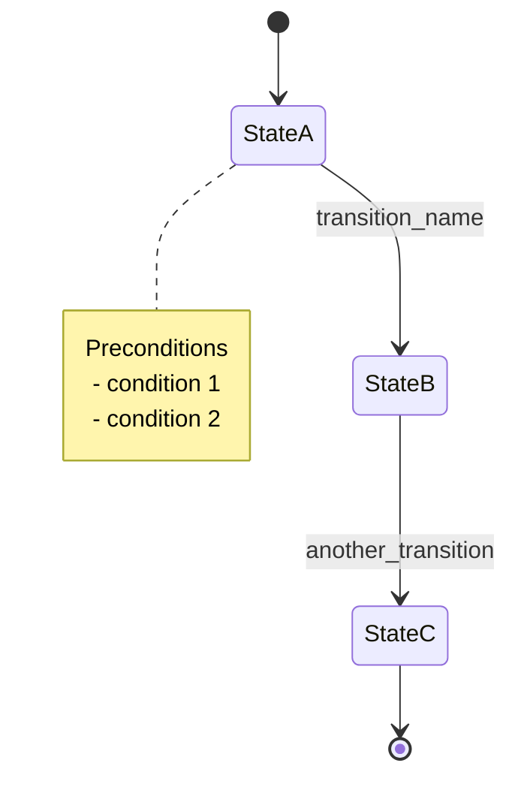
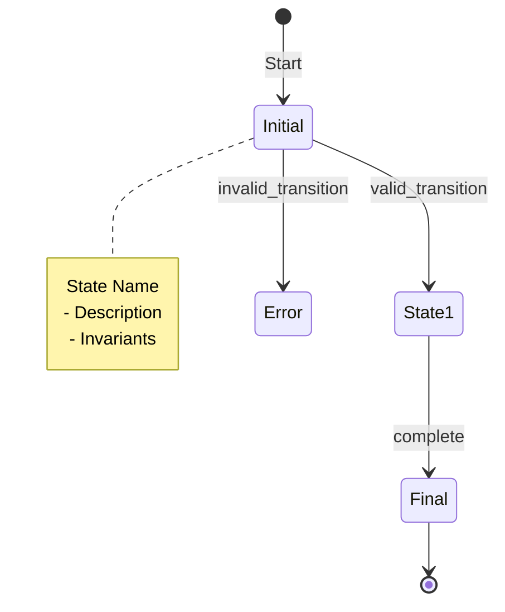
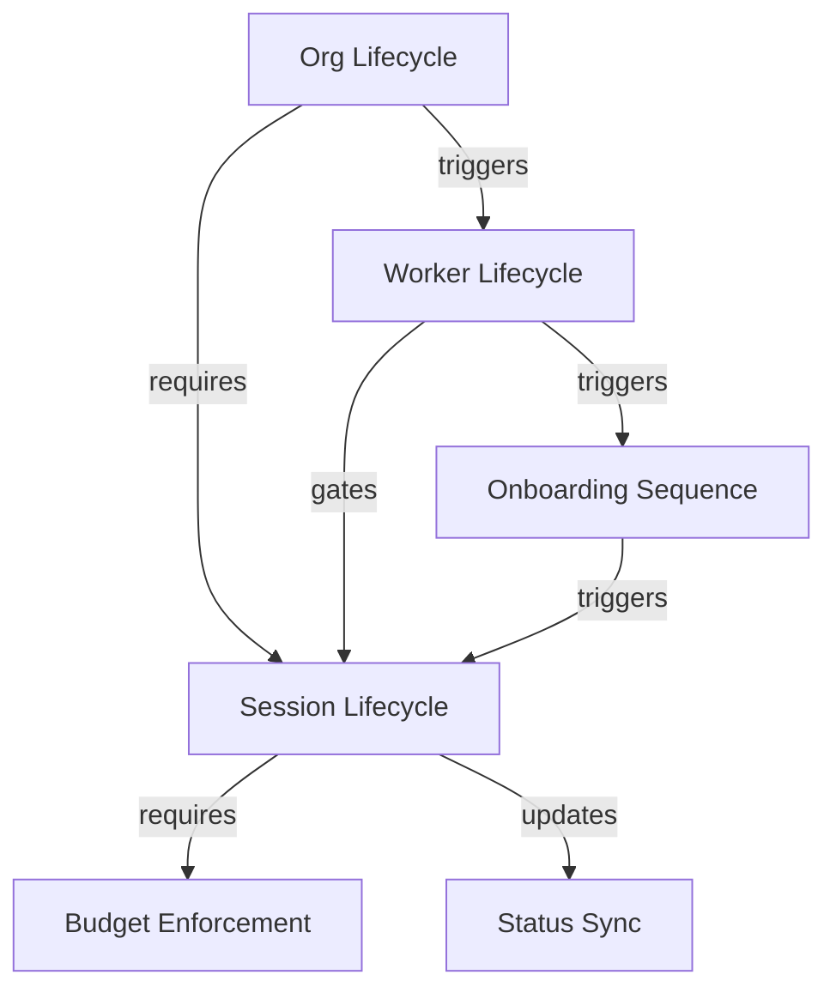
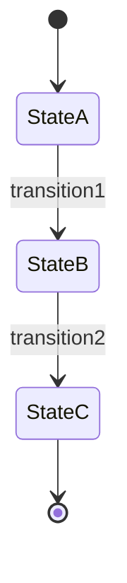
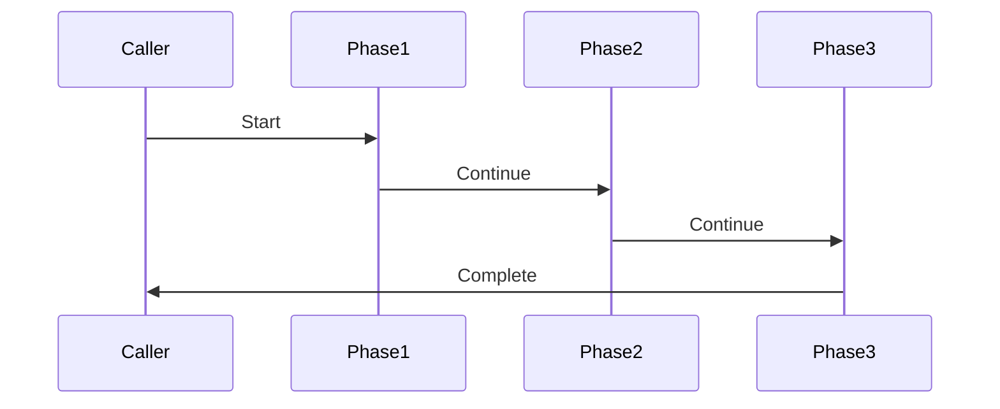
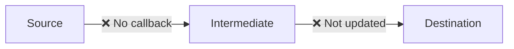
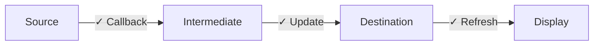
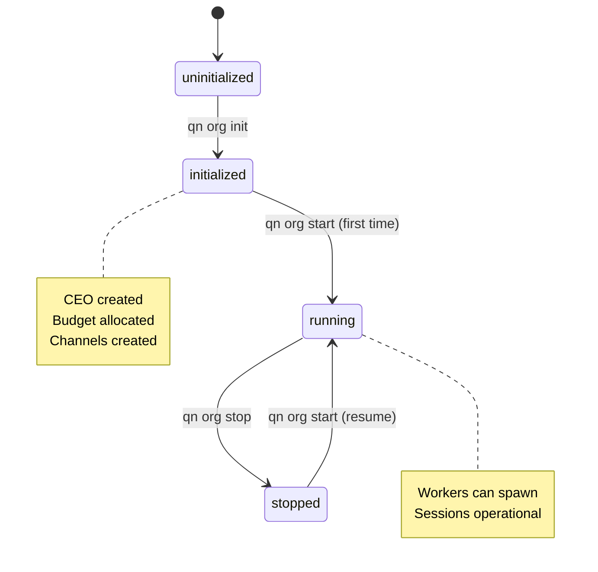

# State Machines Template & Design
**Task:** quinnai-3gls
**Purpose:** Define structure and format for root-level STATEMACHINES.md

---

## Design Principles

1. **Machine-Readable:** Use Mermaid diagrams for visualization
2. **Human-Readable:** Clear prose explanations with examples
3. **Hierarchical:** Root machines → Sub-machines → Dependencies
4. **Cross-Referenced:** Links between dependent systems
5. **Validation-Focused:** Clear rules for implementation verification
6. **Implementation-Tracked:** Current vs desired state documented

---

## Notation Guide

### State Machine Diagram (Mermaid)



### Transition Table Format

| Transition | From | To | Trigger | Preconditions | Actions | Postconditions |
|------------|------|----| --------|---------------|---------|----------------|
| T1 | state_a | state_b | method_call() | - Must be X<br>- Must have Y | 1. Do A<br>2. Do B | - Guarantees Z |

### Dependency Notation

```
Parent Machine
    ├─ triggers → Child Machine (initiates child transition)
    ├─ requires → Sibling Machine (must be in certain state)
    └─ updates → Data Store (modifies shared state)
```

---

## Document Structure

### Level 1: Front Matter

```markdown
# QuinnAI State Machines

**Purpose:** Formal specification of all state machines in QuinnAI
**Version:** 1.0
**Last Updated:** 2026-01-25
**Status:** Draft | Review | Approved

## Table of Contents

1. Overview
2. Notation Guide
3. State Machine Hierarchy
4. Root State Machines
   - 4.1 Org Lifecycle
   - 4.2 Worker Lifecycle
   - 4.3 Session Lifecycle
5. Sub-State Machines
   - 5.1 Onboarding Sequence
   - 5.2 Budget Enforcement
6. Propagation Pipelines
   - 6.1 Status Sync
7. Cross-Machine Validation Rules
8. Implementation Checklist
9. Appendix
   - 9.1 Glossary
   - 9.2 References
```

### Level 2: Overview Section

```markdown
## 1. Overview

### Purpose

This document provides formal specifications for all state machines and
event-driven sequences in QuinnAI. It serves as the single source of truth
for validation, implementation, and testing.

### Scope

Covers:
- Org lifecycle (initialization, start, stop)
- Worker lifecycle (onboarding, activation, termination)
- Session lifecycle (spawn, run, stop)
- Supporting sequences (onboarding, budget, status sync)

Does NOT cover:
- UI state (terminal app internal state)
- External API state (Anthropic, OpenAI)
- File system state (beads, storage)

### How to Use This Document

**For Implementers:**
- Check transition tables for required preconditions and postconditions
- Verify your code matches the specified actions
- Ensure all error cases are handled

**For Testers:**
- Use validation rules to create test cases
- Verify all valid transitions work
- Verify all invalid transitions are rejected

**For Architects:**
- Review dependency graph to understand system interactions
- Identify potential race conditions or deadlocks
- Plan changes that affect multiple state machines
```

### Level 3: Notation Guide Section

```markdown
## 2. Notation Guide

### 2.1 State Diagram Symbols



**Symbols:**
- `[*]` - Start/End point
- `State` - Named state
- `-->` - Transition arrow
- `: label` - Transition name
- `note` - Additional context

### 2.2 Transition Notation

**Format:** `StateA --> StateB : trigger_name`

- **StateA:** Current state (precondition)
- **StateB:** Next state (postcondition)
- **trigger_name:** Method, command, or event that causes transition

### 2.3 Dependency Arrows

- `triggers →` - Parent initiates child state change
- `requires →` - Parent needs child in specific state
- `updates →` - Parent modifies shared data
- `gates →` - Parent blocks child until condition met

### 2.4 Implementation Status Icons

- ✅ Fully implemented and tested
- ⚠️ Partially implemented (works but incomplete)
- ❌ Not implemented or broken
- 🚧 In progress
```

### Level 4: State Machine Hierarchy

```markdown
## 3. State Machine Hierarchy

### 3.1 Dependency Graph



### 3.2 Machine Categories

**Root Machines** (independent lifecycle):
- Org Lifecycle
- Worker Lifecycle
- Session Lifecycle

**Sub-Machines** (part of parent lifecycle):
- Onboarding Sequence (within Worker onboarding state)
- Budget Enforcement (decision tree within Session spawn)

**Propagation Pipelines** (data flow, not state):
- Status Sync (Session → Database → UI)

### 3.3 Execution Order

1. **Org Init:** Org: uninitialized → initialized
2. **Org Start:** Org: initialized → running
   - CEO: pending → onboarding → active
   - Onboarding Sequence: Phase 1-7
   - CEO Session: not_spawned → starting → running
3. **Org Stop:** Org: running → stopped
   - All Sessions: * → stopped
4. **Org Resume:** Org: stopped → running
```

### Level 5: Root State Machine Template

For each root machine (Org, Worker, Session), use this template:

```markdown
## 4.X [Machine Name]

### Overview

**Purpose:** [Brief description]
**Scope:** [What this controls]
**Implementation:** [Primary file location]
**Status:** [✅ ⚠️ ❌ 🚧]

### State Diagram



### States

| State | Description | Invariants | Entry Actions | Exit Actions |
|-------|-------------|------------|---------------|--------------|
| state_a | What it means | - Must have X<br>- Cannot have Y | Initialize Z | Clean up Z |

### Transitions

| ID | From | To | Trigger | Preconditions | Actions | Postconditions | Errors |
|----|------|----|---------| --------------|---------|----------------|--------|
| T1 | a | b | method() | - Must be X | 1. Do A<br>2. Do B | - Guarantees Z | Error1<br>Error2 |

### Transition Details

#### T1: state_a → state_b (`trigger_method()`)

**Implementation:** `file.py:line_number`

**Preconditions:**
- Worker must exist
- Worker must have allocation
- Cost must be <= remaining_credits OR is_ceo = True

**Actions:**
1. Estimate spawn cost based on worker tier
2. Check budget allocation exists
3. Verify sufficient credits (or bypass for CEO)
4. Create session via registry
5. Deduct cost from allocation
6. Record transaction

**Postconditions:**
- Session spawned and attached to worker
- Budget deducted (unless CEO)
- Transaction recorded

**Error Cases:**
- `NoBudgetAllocationError` - No allocation found for worker
- `BudgetExhaustedError` - Insufficient credits remaining
- `ActiveSessionExistsError` - Worker already has active session

**Rollback Strategy:**
- If session spawn fails after budget deduction: **NO ROLLBACK** (current)
- Desired: Transaction wrapping budget + spawn, rollback on failure

**Implementation Status:** ⚠️ Partially implemented (no rollback)

**Example:**
```python
# Valid transition
worker.spawn_session(provider="claude_code")
# worker.runtime_status: not_spawned → starting

# Invalid transition (raises error)
worker.spawn_session()  # Worker already has active session
# Raises: ActiveSessionExistsError
```

**Test Coverage:**
- test_session_spawn_success() - ✅
- test_session_spawn_budget_exhausted() - ✅
- test_session_spawn_rollback() - ❌ NOT TESTED

### Invalid Transitions

| From | To | Why Invalid |
|------|----|-----------
 |
| running | uninitialized | Cannot un-initialize |
| stopped | initialized | Cannot re-initialize |

### Dependencies

**Triggers:**
- When Worker lifecycle = 'active', can spawn Session

**Requires:**
- Budget Enforcement must pass before Session.spawn()

**Updates:**
- Status Sync when session state changes
```

### Level 6: Sub-Machine Template

For sub-machines (Onboarding, Budget), use simplified format:

```markdown
## 5.X [Sub-Machine Name]

### Overview

**Part of:** [Parent machine]
**When:** [During which parent state]
**Purpose:** [What it accomplishes]

### Sequence Diagram



### Phases

| Phase | Description | Inputs | Outputs | Error Recovery |
|-------|-------------|--------|---------|----------------|
| 1 | Prepare | Worker ID | Context | Retry |

### Success Criteria

- All phases complete without error
- Artifacts created in correct locations
- Parent state transitions to next

### Failure Modes

- **Phase N fails:** [Rollback strategy]
- **Timeout:** [Timeout handling]
- **Partial completion:** [Resume capability?]
```

### Level 7: Propagation Pipeline Template

For data flows (Status Sync):

```markdown
## 6.X [Pipeline Name]

### Overview

**Type:** Data Propagation Pipeline
**Purpose:** [What data flows where]
**Latency:** [Target propagation time]

### Current Flow (Broken)



### Desired Flow



### Components

| Component | Current | Desired | Status |
|-----------|---------|---------|--------|
| Source | State change | Callback invoked | ❌ |
| Intermediate | Stale cache | Fresh data | ❌ |
| Destination | Polls manually | Auto-refresh | ❌ |

### Latency Requirements

- Source → Intermediate: < 500ms
- Intermediate → Destination: < 2s
- Total end-to-end: < 2.5s

### Consistency Model

- **Current:** No guarantees (may never propagate)
- **Desired:** Eventually consistent (< 2.5s)
```

### Level 8: Validation Rules

```markdown
## 7. Cross-Machine Validation Rules

### 7.1 State Consistency Rules

1. **Session spawn requires Worker = active**
   - `Session.spawn()` must check `worker.lifecycle_status == 'active'`
   - **Test:** `test_session_spawn_inactive_worker_fails()`
   - **Status:** ✅ Implemented

2. **Org stop requires all Sessions stopped**
   - `Org.stop()` should verify `count(active_sessions) == 0`
   - **Test:** `test_org_stop_with_active_sessions_fails()`
   - **Status:** ❌ Not implemented (continues anyway)

### 7.2 Transition Order Rules

1. **CEO activation during org start**
   - `Org.start()` must call `CEO.start_onboarding()` then `CEO.complete_onboarding()`
   - Order matters: onboarding before active
   - **Test:** `test_org_start_activates_ceo()`
   - **Status:** ✅ Implemented

### 7.3 Data Propagation Rules

1. **Session state → worker_state**
   - Every Session state change must update `worker_state.runtime_status`
   - **Test:** `test_session_state_propagates_to_worker_state()`
   - **Status:** ❌ Not implemented (manual calls only)

### 7.4 Invariant Rules

1. **Only one active session per worker**
   - At most one session with `state IN ('starting', 'running', 'idle', 'working', 'blocked')`
   - **Test:** `test_worker_single_active_session()`
   - **Status:** ✅ Enforced

2. **Budget never negative**
   - `allocated_credits - spent_credits >= 0` (unless CEO bypass)
   - **Test:** `test_budget_non_negative()`
   - **Status:** ✅ Enforced
```

### Level 9: Implementation Checklist

```markdown
## 8. Implementation Checklist

### 8.1 Org Lifecycle

| Transition | Implemented | Tested | Rollback | Status |
|------------|-------------|--------|----------|--------|
| uninitialized → initialized | ✅ | ✅ | ⚠️ Partial | ✅ |
| initialized → running (first) | ✅ | ⚠️ Partial | ❌ None | ⚠️ |
| running → stopped | ✅ | ⚠️ Partial | ❌ None | ⚠️ |
| stopped → running (resume) | ⚠️ Incomplete | ❌ | N/A | ❌ |

**Gaps:**
- [ ] Rollback on CEO activation failure
- [ ] Session health verification before returning
- [ ] Resume behavior should spawn CEO session

### 8.2 Worker Lifecycle

| Transition | Implemented | Tested | Rollback | Status |
|------------|-------------|--------|----------|--------|
| pending → onboarding | ✅ | ✅ | N/A | ✅ |
| onboarding → active | ✅ | ✅ | N/A | ✅ |
| active → suspended | ✅ | ⚠️ Partial | N/A | ⚠️ |
| suspended → active | ✅ | ⚠️ Partial | N/A | ⚠️ |
| * → terminated | ✅ | ✅ | N/A | ✅ |

**Gaps:**
- [ ] Suspend with active session handling
- [ ] Resume after suspend preserves state

### 8.3 Session Lifecycle

| Transition | Implemented | Tested | Rollback | Status |
|------------|-------------|--------|----------|--------|
| not_spawned → starting | ✅ | ✅ | ⚠️ Partial | ⚠️ |
| starting → running | ⚠️ Manual | ❌ | N/A | ❌ |
| running ⇄ idle | ⚠️ Manual | ❌ | N/A | ❌ |
| * → stopped | ✅ | ⚠️ Partial | N/A | ⚠️ |
| * → crashed | ⚠️ Manual | ❌ | N/A | ❌ |

**Gaps:**
- [ ] Automatic state propagation (session → worker_state)
- [ ] Callback system for state changes
- [ ] Budget rollback on spawn failure

### 8.4 Status Sync

| Component | Current | Desired | Status |
|-----------|---------|---------|--------|
| Session callbacks | ❌ No callbacks | ✅ _on_state_change() | ❌ |
| Worker state update | ⚠️ Manual | ✅ Automatic | ❌ |
| Cache invalidation | ❌ Stale | ✅ Fresh | ❌ |
| UI refresh | ❌ Manual | ✅ Auto (2s) | ❌ |

**Gaps:**
- [ ] Implement session state callbacks
- [ ] Add UI auto-refresh timer
- [ ] Fix Worker cache invalidation

### Overall Completion

- **Fully Implemented:** 30%
- **Partially Implemented:** 40%
- **Not Implemented:** 30%

**Priority Fixes:**
1. Session state propagation (CRITICAL)
2. Org start/stop rollback (HIGH)
3. UI auto-refresh (HIGH)
4. Budget rollback (MEDIUM)
```

---

## Example: Complete State Machine Entry

Here's a complete example for the Org Lifecycle state machine:

```markdown
## 4.1 Org Lifecycle

### Overview

**Purpose:** Manage organization initialization, operation, and shutdown
**Scope:** Controls org-level state that gates worker and session operations
**Implementation:** `cli/core/org.py`
**Status:** ⚠️ Partially implemented

### State Diagram



### States

| State | Description | Invariants | Entry Actions | Exit Actions |
|-------|-------------|------------|---------------|--------------|
| uninitialized | Org directory exists, no database | - No quinn.db file<br>- No workers exist | None | None |
| initialized | Database created, CEO pending | - quinn.db exists<br>- CEO lifecycle = 'pending'<br>- Budget allocated | Create root team<br>Create CEO worker | None |
| running | Org operational | - quinn.db exists<br>- CEO lifecycle = 'active'<br>- Sessions can spawn | Activate CEO<br>Spawn CEO session | None |
| stopped | Org paused | - quinn.db exists<br>- Sessions terminated<br>- Workers may be active | Stop all sessions | None |

### Transitions

| ID | From | To | Trigger | Preconditions | Actions | Postconditions | Errors |
|----|------|----|---------| --------------|---------|----------------|--------|
| T1 | uninitialized | initialized | `qn org init` | - Org dir exists<br>- No quinn.db | 1. Create DB<br>2. Create CEO<br>3. Allocate budget | - org_status = 'initialized'<br>- CEO exists | DatabaseError |
| T2 | initialized | running | `qn org start` | - org_status = 'initialized'<br>- Provider valid | 1. Activate CEO<br>2. Deliver briefing<br>3. Spawn session | - org_status = 'running'<br>- CEO active | InvalidOrgTransition |
| T3 | running | stopped | `qn org stop` | - org_status = 'running' | 1. Stop sessions<br>2. Update status | - org_status = 'stopped'<br>- Sessions stopped | None |
| T4 | stopped | running | `qn org start` | - org_status = 'stopped' | 1. Update status | - org_status = 'running' | InvalidOrgTransition |

(... continue with Transition Details section as shown in template ...)
```

---

## File Structure

```
STATEMACHINES.md (root-level)
docs/state-machines/
    ├── extracted-specs.md (source material)
    ├── STATEMACHINES-TEMPLATE.md (this file)
    ├── org-lifecycle.md (detailed spec)
    ├── worker-lifecycle.md (detailed spec)
    ├── session-lifecycle.md (detailed spec)
    ├── onboarding-sequence.md (detailed spec)
    ├── budget-enforcement.md (detailed spec)
    └── status-sync.md (detailed spec)
```

**Integration:** Individual machine docs feed into root STATEMACHINES.md

---

## Validation Checklist

When writing STATEMACHINES.md, ensure:

- [ ] All Mermaid diagrams render correctly
- [ ] All transitions have preconditions documented
- [ ] All transitions have postconditions documented
- [ ] All error cases listed with recovery strategy
- [ ] All dependencies cross-referenced
- [ ] All implementation gaps identified
- [ ] All test coverage gaps listed
- [ ] Document passes markdown lint
- [ ] Examples provided for complex transitions
- [ ] Glossary defines all technical terms

---

## Usage Guidelines

### For Implementers

1. Find the state machine you're working on
2. Locate the specific transition
3. Check preconditions - implement validation
4. Check actions - implement in order
5. Check postconditions - verify guarantees
6. Check errors - implement error handling
7. Write tests covering all cases

### For Reviewers

1. Verify code matches transition spec
2. Check all preconditions are validated
3. Check all postconditions are guaranteed
4. Check all error cases are handled
5. Verify tests exist and pass
6. Check for undocumented transitions (code does something not in spec)

### For Testers

1. Create test case for each valid transition
2. Create test case for each invalid transition
3. Create test case for each error case
4. Verify rollback on failures
5. Test cross-machine dependencies
6. Load test with concurrent transitions

---

## Next Steps

1. Create individual state machine docs (quinnai-rzg5, 1t0c, gng3, 6h5i, jlmw, jer3)
2. Write unified STATEMACHINES.md (quinnai-kpgu)
3. Validate implementation matches spec (quinnai-14r7)
4. Create validation tests (quinnai-oven)
5. Run systemeval tests (quinnai-g0si)
