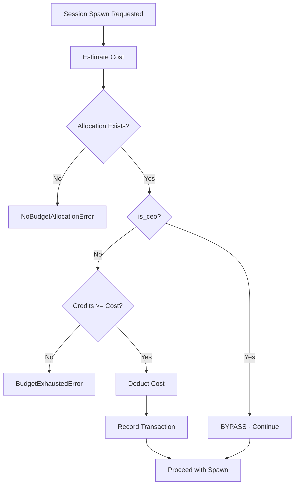

# Budget Enforcement

**Type:** Decision tree within Session spawn (T1)
**Implementation:** `cli/core/worker.py` - `Worker.spawn_session()`
**Status:** ⚠️ Partial (no rollback on spawn failure)

## Decision Flow



## Cost Estimation

**Algorithm:** Based on `worker.cost` tier from workers table

```python
if worker.cost <= 10:
    spawn_cost = 1.0      # Low tier
elif worker.cost <= 50:
    spawn_cost = 5.0      # Medium tier
else:
    spawn_cost = 10.0     # High tier (CEO)
```

**Implementation:** `Worker.spawn_session()` - `worker.py:1229`

---

## Budget Check

### Query: Get Allocation

```sql
SELECT id, allocated_credits, spent_credits, can_delegate
FROM budget_allocations
WHERE worker_id = ? AND period_end > NOW()
ORDER BY period_end ASC
LIMIT 1
```

**Raises:** `NoBudgetAllocationError` if no active allocation found

---

### Query: Check Availability

```python
remaining = allocated_credits - spent_credits

if remaining < spawn_cost:
    raise BudgetExhaustedError(
        worker_id=worker_id,
        required=spawn_cost,
        available=remaining
    )
```

---

### CEO Bypass

```python
if worker.role == 'CEO':
    # Skip all budget checks
    # Proceed directly to spawn
    pass
```

**Rationale:** CEO has unlimited budget authority

---

## Budget Deduction

### Update Allocation

```sql
UPDATE budget_allocations
SET spent_credits = spent_credits + ?
WHERE id = ? AND period_end > NOW()
```

**Atomic:** Yes (single UPDATE statement)

---

### Record Transaction

```sql
INSERT INTO budget_transactions (
    id,
    allocation_id,
    amount,
    transaction_type,
    description,
    created_at
) VALUES (?, ?, ?, 'debit', 'Session spawn', NOW())
```

**Purpose:** Audit trail of all budget operations

---

## Rollback Strategy

### Current Behavior

**Problem:** If session spawn fails AFTER budget deduction:
- Budget is deducted
- No session spawned
- Budget NOT refunded

**Example failure:**
1. Deduct 5.0 credits ✅
2. Record transaction ✅
3. Spawn session → **FAILS** ❌
4. Result: -5.0 credits, no session

### Desired Behavior

**Solution:** Transaction wrapping budget + spawn

```python
with db.transaction():
    # 1. Deduct budget
    deduct_budget(worker_id, cost)

    try:
        # 2. Spawn session
        session = spawn_session_process(config)
    except Exception:
        # Transaction rollback on exception
        # Budget automatically refunded
        raise

    # 3. Commit if both succeed
```

**Status:** ❌ Not implemented (no transaction wrapping)

---

## Budget Delegation

### Manager Allocation to Reports

**Feature:** Managers can allocate portion of their budget to direct reports

**Table:** `budget_delegations`
```sql
CREATE TABLE budget_delegations (
    id TEXT PRIMARY KEY,
    from_allocation_id TEXT,  -- Manager's allocation
    to_worker_id TEXT,         -- Report
    delegated_amount REAL,
    created_at TIMESTAMP
)
```

### Constraints

**From allocation:**
- `can_delegate = True` (must have delegation permission)
- `delegation_limit` - Max amount delegatable per subordinate
- Remaining: `allocated_credits - spent_credits - sum(delegated_amount)`

**Example:**
```
Manager allocation: 100.0 credits
delegation_limit: 50.0
Spent: 20.0
Delegated to Report A: 30.0
Remaining available: 50.0 (100 - 20 - 30)
Can delegate to Report B: max 20.0 (limited by 50.0 cap)
```

---

## Error Cases

| Error | Condition | Recovery |
|-------|-----------|----------|
| NoBudgetAllocationError | No active allocation | Admin must create allocation |
| BudgetExhaustedError | remaining < cost | Wait for new period or request delegation |
| AllocationExpiredError | period_end < NOW | Budget admin renews allocation |

---

## Implementation Notes

**Primary file:** `cli/core/worker.py` - `Worker.spawn_session()` lines 1229-1258

**Budget tables:**
- `budget_pools` - Org-wide budget pools
- `budget_allocations` - Worker-specific allocations
- `budget_transactions` - Audit log of all operations
- `budget_delegations` - Manager → Report delegations

**Query helpers:**
- `get_budget_allocation(db, worker_id)` - Get active allocation
- `deduct_budget(db, allocation_id, amount)` - Deduct + record
- `get_budget_remaining(db, worker_id)` - Calculate remaining credits

**Constants:**
- `DEFAULT_CEO_COST = 100.0` - CEO worker cost tier
- Budget periods: 30 days (configurable in org init)
