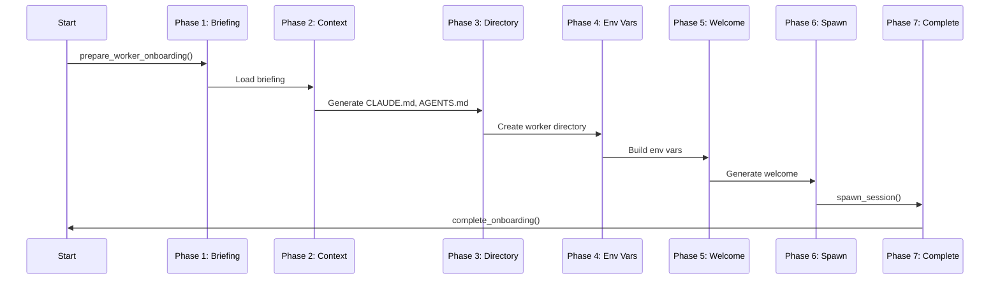

# Onboarding Sequence

**Type:** Sequential workflow within Worker 'onboarding' lifecycle state
**Implementation:** `cli/core/onboarding.py`
**Status:** ⚠️ Partial (works but no error recovery, no checkpointing)

## Sequence



## Phases

| Phase | Function | Inputs | Outputs | Idempotent |
|-------|----------|--------|---------|------------|
| 1 | Briefing Prep | worker_id, org_path | briefing_content or None | Yes |
| 2 | Context Gen | worker_data, org_structure | CLAUDE.md, AGENTS.md, README.md | Yes |
| 3 | Directory Setup | org_path, worker_id | storage/workers/{id}/ | Yes |
| 4 | Env Vars | context, org_path | Dict of env vars | Yes |
| 5 | Welcome Msg | context, worker_dir | Welcome string | Yes |
| 6 | Session Spawn | worker, SessionConfig | Active session | **No** |
| 7 | Complete | worker_id | lifecycle = 'active' | Yes |

## Phase Details

### Phase 1: Briefing Preparation

**Implementation:** `prepare_worker_onboarding()` - `onboarding.py`

**Actions:**
1. Load worker data from database
2. Check if config/{role}_briefing.md exists
3. Read briefing content if exists

**Output:** `OnboardingContext` with briefing_content or None

**Retry:** Safe (read-only)

---

### Phase 2: Context Generation

**Implementation:** `prepare_worker_onboarding()` - `onboarding.py`

**Actions:**
1. Generate CLAUDE.md (role-specific instructions)
2. Generate AGENTS.md (team hierarchy, escalation paths)
3. Generate README.md (worker overview)
4. Write files to shared/onboarding/configs/

**Output:** Context files in shared/onboarding/configs/

**Retry:** Safe (overwrites existing files)

---

### Phase 3: Directory Setup

**Implementation:** `prepare_worker_onboarding()` - `onboarding.py`

**Actions:**
1. Create storage/workers/{worker_id}/
2. Copy CLAUDE.md, AGENTS.md, README.md to worker dir

**Output:** Worker directory ready with context files

**Retry:** Safe (mkdir -p, copy overwrites)

---

### Phase 4: Environment Variables

**Implementation:** `get_worker_env_vars()` - `onboarding.py`

**Actions:**
1. Build env var dict:
   - WORKER_ID
   - WORKER_NAME
   - WORKER_ROLE
   - BRIEFING_PATH (if briefing exists)
   - ORG_PATH
   - WORKER_DIR

**Output:** Dict of environment variables

**Retry:** Safe (pure function)

---

### Phase 5: Welcome Message

**Implementation:** `generate_welcome_message()` or `generate_returning_message()` - `onboarding.py`

**Actions:**
1. Check if first-time or returning (based on session history)
2. Generate appropriate welcome message
3. Include briefing reference if first-time

**Output:** Welcome message string

**Retry:** Safe (pure function)

---

### Phase 6: Session Spawn

**Implementation:** `worker.spawn(config)` → `Worker.spawn_session()`

**Actions:**
1. Create session via registry (adapter-specific)
2. Attach session to worker
3. Start session process
4. **Deduct budget**
5. **Create session record**

**Output:** Active session

**Retry:** ❌ NOT SAFE
- Spawns process
- Deducts budget
- Check for existing session first

---

### Phase 7: Completion

**Implementation:** `worker.complete_onboarding()` - `worker.py`

**Actions:**
1. Validate lifecycle transition (onboarding → active)
2. Update worker lifecycle_status = 'active'

**Output:** Worker ready for work

**Retry:** Safe (idempotent state update)

---

## CEO Special Case

During org start (Org: initialized → running), CEO onboarding includes additional steps:

**After Phase 7:**
1. Check if config/ceo_briefing.md exists
2. If exists and not already delivered:
   - Create message in board-channel
   - Create P0 notification bead for CEO
   - Message content: briefing markdown

**Implementation:** `Org._deliver_ceo_briefing()` - `org.py:268`

**Idempotent:** Yes (checks for existing message)

---

## Error Handling

### Phases 1-5: Retryable
- All read-only or idempotent file operations
- Safe to restart from Phase 1

### Phase 6: NOT Retryable
- Spawns process
- Deducts budget
- Must check for existing session before retry

### Phase 7: Retryable
- Idempotent state update

### Rollback Strategy

**Current:** ❌ No rollback
- If Phase 6 fails: Budget deducted, no session spawned
- If Phase 7 fails: Worker stuck in 'onboarding' state, session running

**Desired:**
- Transaction wrapping budget + spawn
- Rollback budget if spawn fails
- Kill spawned process if completion fails

---

## Checkpointing

**Current:** ❌ No checkpoints
- Must restart from Phase 1 on failure

**Desired:**
- Checkpoint after each phase
- Resume from last successful phase
- Store checkpoint in worker_state table

**Checkpoint data:**
```sql
ALTER TABLE worker_state ADD COLUMN onboarding_checkpoint TEXT;
-- Values: 'briefing_prepared', 'context_generated', etc.
```

---

## Implementation Notes

**Main function:** `prepare_worker_onboarding(db, worker_id, org_path)` - Phases 1-5
**Trigger:** Called by `Org.start()` or `qn org start --worker=name`
**Directory structure created:**
```
storage/workers/{worker_id}/
    ├── CLAUDE.md
    ├── AGENTS.md
    └── README.md
```

**Context artifacts:**
```
shared/onboarding/configs/
    ├── CLAUDE.md (templates)
    ├── AGENTS.md (templates)
    └── README.md (templates)
```
