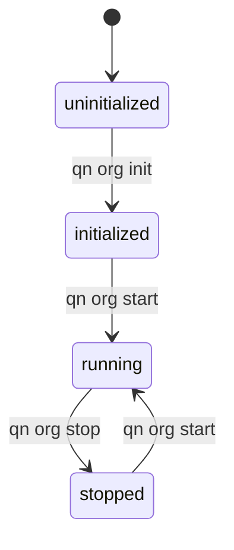

# Org Lifecycle State Machine

**Implementation:** `cli/core/org.py`
**Commands:** `qn org init`, `qn org start`, `qn org stop`
**Status:** ⚠️ Partial (no rollback, inconsistent resume)

## State Diagram

## States

| State | Description | Key Invariants |
|-------|-------------|----------------|
| uninitialized | Org directory exists, no database | No quinn.db file |
| initialized | Database created, CEO pending | CEO lifecycle = 'pending', budget allocated |
| running | Org operational | CEO lifecycle = 'active', sessions can spawn |
| stopped | Org paused | Sessions terminated, can resume |

## Transitions

### T1: uninitialized → initialized

**Trigger:** `qn org init --ceo-name="Name" --budget=1000`
**Implementation:** `Org.init()` - `cli/core/org.py:127`

**Preconditions:**
- Org directory exists
- No quinn.db file

**Actions:**
1. Create root team ("Executive")
2. Create CEO worker (no manager, high cost)
3. Add CEO to team_members
4. Create budget pool (30-day period)
5. Allocate budget to CEO (can_delegate=True)
6. Subscribe CEO to team channel
7. Create org-wide channels (general, board-channel)
8. Initialize beads database
9. Set org_status = 'initialized'

**Postconditions:**
- org_status = 'initialized'
- CEO exists, lifecycle = 'pending'
- Budget allocated
- Channels created

**Errors:**
- DatabaseError → Rollback, remove quinn.db

**Status:** ✅ Implemented

---

### T2: initialized → running (first start)

**Trigger:** `qn org start`
**Implementation:** `Org.start()` - `cli/core/org.py:223`

**Preconditions:**
- org_status = 'initialized'
- CEO worker exists
- Provider config valid

**Actions:**
1. Validate state transition
2. CEO.start_onboarding() → lifecycle = 'onboarding'
3. CEO.complete_onboarding() → lifecycle = 'active'
4. If config/ceo_briefing.md exists:
   - Create message in board-channel
   - Create notification bead (P0)
   - Skip if already delivered
5. Set org_status = 'running'
6. Update org-chart
7. If --spawn-ceo=True:
   - prepare_worker_onboarding()
   - generate_welcome_message()
   - spawn_session()

**Postconditions:**
- org_status = 'running'
- CEO lifecycle = 'active'
- CEO session spawned (if requested)

**Errors:**
- InvalidOrgTransition
- CEO activation fails → **INCONSISTENT STATE** (org running, CEO not active)
- Session spawn fails → **INCONSISTENT STATE** (org running, no CEO session)

**Rollback:** ❌ None implemented

**Status:** ⚠️ Partial (no rollback, leaves inconsistent state on failure)

---

### T3: running → stopped

**Trigger:** `qn org stop [--force] [--no-cleanup]`
**Implementation:** `Org.stop()` - `cli/core/org.py:351`

**Preconditions:**
- org_status = 'running'

**Actions:**
1. stop_all_sessions(db, force=force)
2. Validate state transition
3. Set org_status = 'stopped'
4. If --cleanup=True (default):
   - run_notification_cleanup()

**Postconditions:**
- org_status = 'stopped'
- Sessions stopped (best-effort)

**Errors:**
- Some sessions fail to stop → **Continues anyway**, shows warnings
- Cleanup fails → **Org already stopped**, no rollback

**Status:** ⚠️ Partial (no session stop verification)

---

### T4: stopped → running (resume)

**Trigger:** `qn org start`
**Implementation:** `Org.start()` - `cli/core/org.py:251`

**Preconditions:**
- org_status = 'stopped'

**Actions:**
1. Validate state transition
2. Set org_status = 'running'

**Postconditions:**
- org_status = 'running'
- CEO lifecycle unchanged (already 'active')
- **NO CEO SESSION SPAWNED**

**Errors:**
- InvalidOrgTransition

**Status:** ❌ Broken (inconsistent with T2, doesn't spawn CEO session)

---

## Invalid Transitions

| From | To | Error |
|------|----|-|
| initialized | stopped | Must start first |
| uninitialized | running | Must init first |
| running | uninitialized | Cannot un-init |
| stopped | initialized | Cannot re-init |

## Dependencies

**Triggers:**
- T2 (initialized → running): Triggers Worker lifecycle (CEO: pending → onboarding → active)
- T2: Triggers Onboarding Sequence (if spawning CEO)
- T3 (running → stopped): Requires all Sessions stop

**Gates:**
- Worker.spawn_session() requires org_status = 'running'

## Critical Gaps

1. **No rollback on T2 failure** - CEO activation or session spawn fails → inconsistent state
2. **No session health check** - T2 returns before verifying CEO session ready
3. **Inconsistent resume** - T4 doesn't spawn CEO session (different from T2)
4. **No session stop verification** - T3 updates status even if sessions fail to stop

## Implementation Notes

**File:** `cli/core/org.py`
**State storage:** `org_state` table (status, ceo_worker_id, started_at, stopped_at)
**State validation:** Uses `ORG_TRANSITIONS` dict from `shared/__init__.py`
**Transition guard:** `_validate_transition()` checks valid moves

**Commands:**
- `cli/commands/org/init.py` → calls `Org.init()`
- `cli/commands/org/start.py` → calls `Org.start()`
- `cli/commands/org/stop.py` → calls `Org.stop()`
