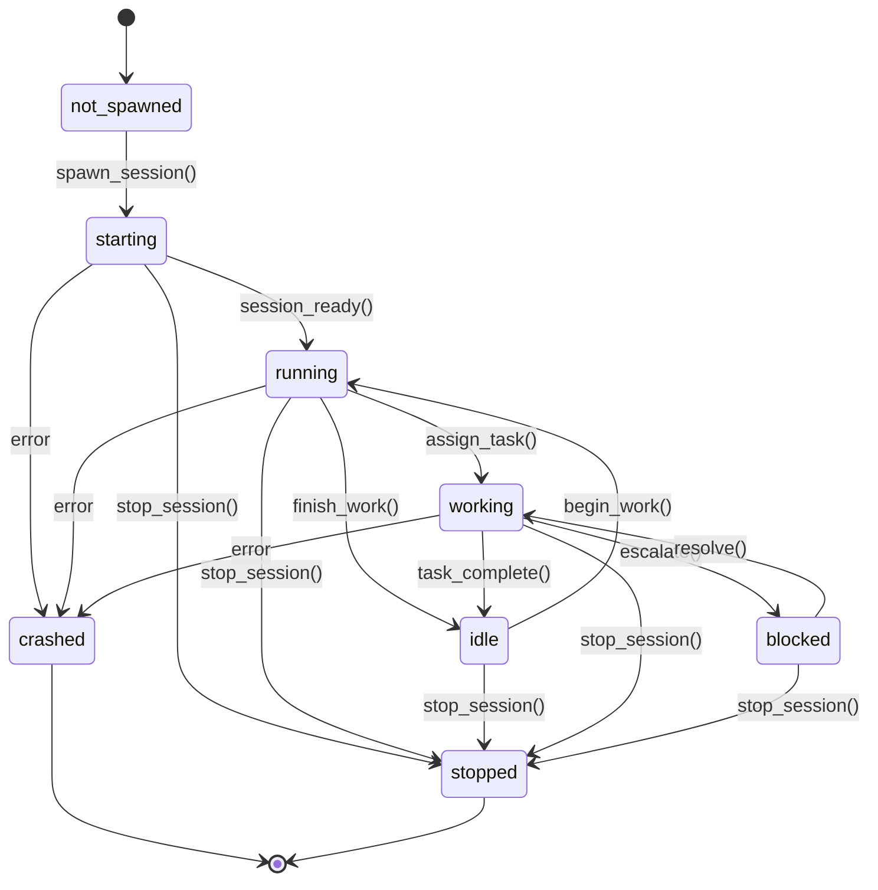

# Session Lifecycle State Machine

**Implementation:** `cli/core/worker.py`, `cli/core/sessions/*.py`
**Status:** ❌ Broken (manual transitions, no auto-propagation)

## State Diagram



## States

| State | Description | worker_state.runtime_status |
|-------|-------------|------------------------------|
| not_spawned | No session exists | NULL or 'stopped' |
| starting | Session spawn in progress | 'starting' |
| running | Session ready, can accept work | 'running' |
| idle | Session ready, no current task | 'idle' |
| working | Actively executing task | 'working' |
| blocked | Waiting on external dependency | 'blocked' |
| stopped | Cleanly terminated | 'stopped' |
| crashed | Abnormally terminated | 'crashed' |

## Transitions

### T1: not_spawned → starting

**Trigger:** `worker.spawn_session(config)` or `qn org start --worker=name`
**Implementation:** `Worker.spawn_session()` - `worker.py:1163`

**Preconditions:**
- Worker lifecycle = 'active'
- No existing active session
- Budget available OR is_ceo=True

**Actions:**
1. Validate worker can spawn
2. Check worker_state for existing session → raises ActiveSessionExistsError
3. Estimate spawn cost (based on worker.cost tier)
4. Check budget allocation → raises NoBudgetAllocationError or BudgetExhaustedError
5. Create session via registry (adapter-specific)
6. **Update worker_state.runtime_status = 'starting'**
7. Update worker_state.pid (if available)
8. Record spend against budget
9. Create session record in sessions table

**Postconditions:**
- worker_state.runtime_status = 'starting'
- Session process spawning
- Budget deducted
- Session record created

**Errors:**
- ActiveSessionExistsError - Cannot spawn duplicate
- NoBudgetAllocationError - No allocation found
- BudgetExhaustedError - Insufficient credits
- Provider error - Session spawn failed

**Rollback:** ❌ None (budget deducted even if spawn fails)

**Status:** ⚠️ Partial (no rollback)

---

### T2: starting → running

**Trigger:** `worker.session_ready()`
**Implementation:** `Worker.session_ready()` - `worker.py:1032`

**Preconditions:**
- worker_state.runtime_status = 'starting'
- Session adapter reports ready

**Actions:**
1. Validate runtime transition
2. **Update worker_state.runtime_status = 'running'**

**Postconditions:**
- worker_state.runtime_status = 'running'
- Session can accept tasks

**Status:** ❌ Broken (session adapter doesn't call this automatically)

---

### T3: running ⇄ idle

**Trigger:** `worker.finish_work()` / `worker.begin_work()`
**Implementation:** `Worker.finish_work()`, `Worker.begin_work()`

**Actions (running → idle):**
1. Validate runtime transition
2. **Update worker_state.runtime_status = 'idle'**
3. Clear worker_state.current_task_id

**Actions (idle → running):**
1. Validate runtime transition
2. **Update worker_state.runtime_status = 'running'**

**Status:** ❌ Broken (manual calls only, no automatic triggers)

---

### T4: running → working

**Trigger:** Task assignment
**Implementation:** Manual update

**Actions:**
1. **Update worker_state.runtime_status = 'working'**
2. Set worker_state.current_task_id

**Status:** ❌ Broken (manual, not called by task system)

---

### T5: working → blocked

**Trigger:** Escalation or wait for resource
**Implementation:** Manual update

**Actions:**
1. **Update worker_state.runtime_status = 'blocked'**
2. Record blocking reason

**Status:** ❌ Broken (manual)

---

### T6: blocked → working

**Trigger:** Issue resolved
**Implementation:** Manual update

**Actions:**
1. **Update worker_state.runtime_status = 'working'**

**Status:** ❌ Broken (manual)

---

### T7: any → stopped

**Trigger:** `worker.stop_session(force=False)` or `qn org stop --worker=name`
**Implementation:** `Worker.stop_session()` - `worker.py:~1100`

**Preconditions:**
- Session exists

**Actions:**
1. Gracefully stop session (signal handler, cleanup)
2. **Update worker_state.runtime_status = 'stopped'**
3. Clear worker_state.pid
4. Update sessions table: state = 'stopped'

**Postconditions:**
- worker_state.runtime_status = 'stopped'
- Session process terminated

**Status:** ✅ Implemented

---

### T8: any → crashed

**Trigger:** Session error, timeout, or kill
**Implementation:** `Worker.crash_session()`

**Preconditions:**
- Session encounters fatal error

**Actions:**
1. Detect crash (process exit, exception, timeout)
2. **Update worker_state.runtime_status = 'crashed'**
3. Clear worker_state.pid
4. Update sessions table: state = 'crashed'
5. Log error details

**Postconditions:**
- worker_state.runtime_status = 'crashed'
- Error logged

**Status:** ❌ Broken (crash detection may not trigger this)

---

## Invalid Transitions

| From | To | Error |
|------|----|-|
| not_spawned | running | Must start first |
| working | starting | Session already running |

## Dependencies

**Requires:**
- Worker lifecycle = 'active' (T1 precondition)
- Budget Enforcement passes (T1)

**Updates:**
- worker_state.runtime_status (ALL transitions)
- Status Sync pipeline (should trigger on ALL transitions)

## Critical Issue: No Automatic Propagation

**Problem:** Session adapters change state internally but DON'T call Worker methods.

**Current flow:**
```
Session State Change (in adapter)
    ↓
  ❌ NO CALLBACK
    ↓
Worker methods NOT called
    ↓
worker_state table NOT updated
    ↓
UI shows stale data
```

**Required flow:**
```
Session State Change (in adapter)
    ↓
  ✓ Callback: _on_state_change(old, new)
    ↓
  ✓ Map session state → runtime_status
    ↓
  ✓ update_worker_runtime_status(db, worker_id, status)
    ↓
worker_state table UPDATED
```

**Fix:** Session adapters need callbacks in:
- `cli/core/sessions/claude_code.py`
- `cli/core/sessions/gemini.py`
- Base session class in `cli/core/sessions/__init__.py`

## Implementation Notes

**State storage:**
- `worker_state` table: runtime_status, current_task_id, pid
- `sessions` table: state, worker_id, started_at, stopped_at

**Transition methods:**
- `Worker.spawn_session()` - T1
- `Worker.session_ready()` - T2 (NOT CALLED AUTOMATICALLY)
- `Worker.begin_work()` / `Worker.finish_work()` - T3 (MANUAL)
- `Worker.stop_session()` - T7
- `Worker.crash_session()` - T8 (MAY NOT BE CALLED)

**Query helper:**
- `update_worker_runtime_status(db, worker_id, status)` - Direct DB update

**Session Adapters:**
- `cli/core/sessions/claude_code.py` - Claude Code sessions
- `cli/core/sessions/gemini.py` - Gemini sessions
- Base class defines `_on_state_change()` but implementations don't call Worker methods
