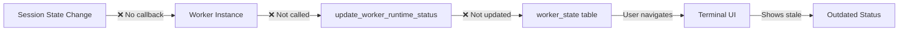
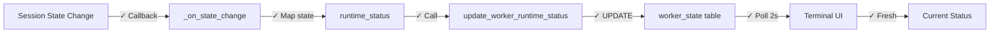

# Status Sync Propagation

**Type:** Data propagation pipeline
**Purpose:** Session state → Database → UI
**Status:** ❌ Broken (no automatic propagation)

## Current Flow (Broken)



**Problem:** Sessions change state internally, Worker methods never called, database never updated.

---

## Desired Flow



**Solution:** Callbacks + auto-refresh

---

## Components

### 1. Session Adapter State Change

**Location:** `cli/core/sessions/claude_code.py`, `cli/core/sessions/gemini.py`

**Current:**
```python
def _on_state_change(self, old_state, new_state):
    # Callback exists but does nothing with Worker
    self._state = new_state
    # ❌ NO database update
```

**Required:**
```python
def _on_state_change(self, old_state, new_state):
    self._state = new_state

    # Map session state to worker runtime_status
    runtime_status = self._map_state(new_state)

    # Update database
    update_worker_runtime_status(
        self._db,
        self._worker_id,
        runtime_status
    )
```

**State Mapping:**
| Session State | runtime_status |
|---------------|----------------|
| starting | starting |
| running | running |
| idle | idle |
| stopped | stopped |
| crashed | crashed |
| error | crashed |

---

### 2. Worker State Update

**Location:** `cli/core/queries.py:677`

**Current:**
```python
def update_worker_runtime_status(
    db: Database,
    worker_id: str,
    runtime_status: str,
    current_task_id: Optional[str] = None,
) -> None:
    now = datetime.now()
    db.execute(
        """UPDATE worker_state SET runtime_status = ?, current_task_id = ?,
           last_activity = ?, updated_at = ? WHERE worker_id = ?""",
        (runtime_status, current_task_id, now, now, worker_id)
    )
    db.connection.commit()
```

**Status:** ✅ Works (direct database UPDATE)

**Issue:** Multiple code paths call this, potential race conditions

---

### 3. Worker Cache Invalidation

**Location:** `cli/core/worker.py:600`

**Current:**
```python
@property
def runtime_status(self) -> Optional[str]:
    if self._state_data is None:
        self._load_state()
    return self._state_data.runtime_status if self._state_data else None
```

**Problem:** Caches `_state_data` after first load, returns stale data

**Fix:**
```python
@property
def runtime_status(self) -> Optional[str]:
    # ALWAYS reload for runtime status (frequently changing)
    self._load_state()
    return self._state_data.runtime_status if self._state_data else None
```

---

### 4. UI Auto-Refresh

**Location:** `terminal-app/src/board_ui/views/team.py:76`

**Current:**
```python
async def on_mount(self) -> None:
    await self.refresh_workers()
    # ❌ No periodic refresh
```

**Fix:**
```python
async def on_mount(self) -> None:
    await self.refresh_workers()

    # Auto-refresh every 2 seconds
    self.set_interval(2.0, self.refresh_workers)
```

**Also fix:** `terminal-app/src/board_ui/views/dashboard.py` (CEO status)

---

## Latency Requirements

| Step | Target | Current |
|------|--------|---------|
| Session change → Database | < 500ms | ∞ (never) |
| Database → UI poll | < 2s | ∞ (manual) |
| Total end-to-end | < 2.5s | ∞ (never) |

---

## Consistency Model

**Current:** No consistency
- Session state and worker_state are independent
- Can diverge indefinitely
- No detection of inconsistency

**Desired:** Eventually consistent
- All session state changes propagate to worker_state
- UI reflects database state within 2 seconds
- Stale data automatically replaced

---

## Data Sources

### Primary: worker_state Table

```sql
CREATE TABLE worker_state (
    worker_id TEXT PRIMARY KEY,
    runtime_status TEXT,
    current_task_id TEXT,
    pid INTEGER,
    last_activity TIMESTAMP,
    updated_at TIMESTAMP,
    tasks_completed INTEGER,
    tasks_failed INTEGER
)
```

**Authoritative for:** runtime_status, current_task_id
**Updated by:** update_worker_runtime_status()
**Read by:** Terminal UI, CLI commands

---

### Secondary: sessions Table

```sql
CREATE TABLE sessions (
    id TEXT PRIMARY KEY,
    worker_id TEXT,
    state TEXT,
    started_at TIMESTAMP,
    stopped_at TIMESTAMP,
    pid INTEGER
)
```

**Authoritative for:** Session lifecycle history
**Not used for:** Real-time status display

---

## Implementation Files

**Session Adapters:**
- `cli/core/sessions/claude_code.py` - Add callback
- `cli/core/sessions/gemini.py` - Add callback
- `cli/core/sessions/__init__.py` - Base session class

**Worker:**
- `cli/core/worker.py` - Fix cache invalidation (line 600)

**Terminal UI:**
- `terminal-app/src/board_ui/views/team.py` - Add auto-refresh (line 72)
- `terminal-app/src/board_ui/views/dashboard.py` - Add auto-refresh

**Queries:**
- `cli/core/queries.py` - Already works (line 677)

---

## Race Conditions

### Concurrent Updates

**Scenario:**
1. Session A changes state → Update runtime_status = 'running'
2. Session B (same worker) changes state → Update runtime_status = 'crashed'
3. Order non-deterministic → final state unpredictable

**Solution:** Database-level constraint
```sql
-- Only one active session per worker
CREATE UNIQUE INDEX idx_active_session ON sessions(worker_id)
WHERE state IN ('starting', 'running', 'idle', 'working', 'blocked');
```

**Enforced at:** Session spawn (raises ActiveSessionExistsError)

---

## Heartbeat System

**Purpose:** Detect crashed sessions that didn't trigger crash callback

**Implementation:** `cli/core/queries.py:684`

```python
def record_worker_heartbeat(db: Database, worker_id: str) -> None:
    now = datetime.now()
    db.execute(
        "UPDATE worker_state SET last_activity = ?, updated_at = ? WHERE worker_id = ?",
        (now, now, worker_id)
    )
    db.connection.commit()
```

**Trigger:** Session adapters should call every 30 seconds

**Stale Detection:**
```python
# If last_activity > 60 seconds and runtime_status = 'running'
# Auto-transition to 'crashed'
```

**Status:** ⚠️ Function exists but not called by sessions

---

## Test Scenarios

| Scenario | Expected | Current |
|----------|----------|---------|
| Session starts | UI shows 'starting' < 2.5s | ❌ Never updates |
| Session ready | UI shows 'running' < 2.5s | ❌ Never updates |
| Session crashes | UI shows 'crashed' < 2.5s | ❌ Never updates |
| Navigate away/back | UI shows fresh data | ⚠️ Shows stale cached data |
| 100 rapid changes | UI eventually consistent | ❌ No updates at all |
