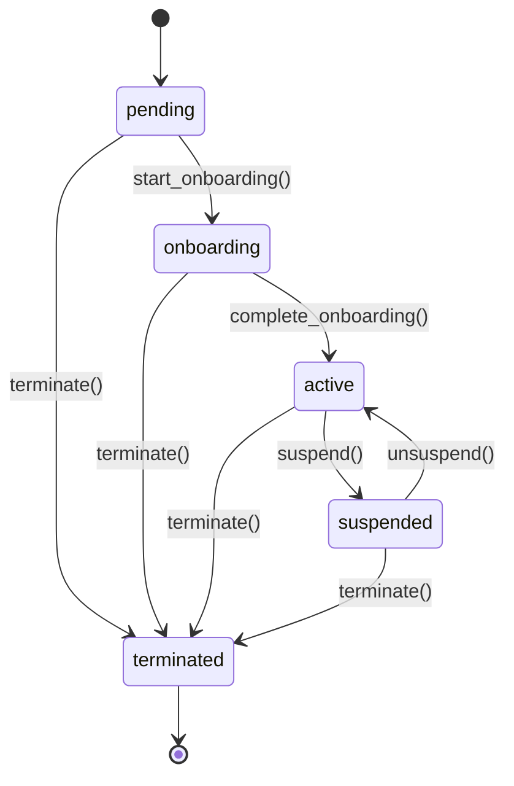

# Worker Lifecycle State Machine

**Implementation:** `cli/core/worker.py`
**Commands:** `qn org hire`, `qn org fire`, worker methods
**Status:** ✅ Implemented

## State Diagram

## States

| State | Description | can_work | Sessions Allowed |
|-------|-------------|----------|------------------|
| pending | Created, not onboarded | False | No |
| onboarding | Activation in progress | False | No |
| active | Fully operational | True | Yes |
| suspended | Temporarily inactive | False | No |
| terminated | Permanently removed | False | No |

## Transitions

### T1: pending → onboarding

**Trigger:** `worker.start_onboarding()`
**Implementation:** `Worker.start_onboarding()` - `worker.py:~800`

**Preconditions:**
- lifecycle_status = 'pending'

**Actions:**
1. Validate lifecycle transition
2. Set lifecycle_status = 'onboarding'

**Postconditions:**
- lifecycle_status = 'onboarding'
- Onboarding Sequence can begin

**Status:** ✅ Implemented

---

### T2: onboarding → active

**Trigger:** `worker.complete_onboarding()`
**Implementation:** `Worker.complete_onboarding()` - `worker.py:~850`

**Preconditions:**
- lifecycle_status = 'onboarding'
- Onboarding sequence completed

**Actions:**
1. Validate lifecycle transition
2. Set lifecycle_status = 'active'

**Postconditions:**
- lifecycle_status = 'active'
- can_work = True
- Sessions can be spawned

**Status:** ✅ Implemented

---

### T3: active → suspended

**Trigger:** `worker.suspend(force=False)`
**Implementation:** `Worker.suspend()`

**Preconditions:**
- lifecycle_status = 'active'
- No active session OR force=True

**Actions:**
1. Validate lifecycle transition
2. Stop active session (if exists)
3. Set lifecycle_status = 'suspended'

**Postconditions:**
- lifecycle_status = 'suspended'
- can_work = False

**Status:** ✅ Implemented

---

### T4: suspended → active

**Trigger:** `worker.unsuspend()`
**Implementation:** `Worker.unsuspend()`

**Preconditions:**
- lifecycle_status = 'suspended'

**Actions:**
1. Validate lifecycle transition
2. Set lifecycle_status = 'active'

**Postconditions:**
- lifecycle_status = 'active'
- can_work = True

**Status:** ✅ Implemented

---

### T5: any → terminated

**Trigger:** `worker.terminate(force=True)` or `qn org fire <worker>`
**Implementation:** `Worker.terminate()`

**Preconditions:**
- Worker exists

**Actions:**
1. Stop active session (force=True)
2. Set lifecycle_status = 'terminated'

**Postconditions:**
- lifecycle_status = 'terminated'
- can_work = False
- Cannot spawn sessions
- Worker record remains (soft delete)

**Status:** ✅ Implemented

---

## Invalid Transitions

| From | To | Why |
|------|----|-|
| pending | active | Must onboard first |
| onboarding | suspended | Must complete onboarding |
| terminated | any | Permanent state |

## Dependencies

**Gates:**
- Session.spawn() requires worker lifecycle = 'active'

**Triggered by:**
- Org.start() (T2: initialized → running) triggers CEO: pending → onboarding → active

**Triggers:**
- T1 (pending → onboarding): Triggers Onboarding Sequence

## Implementation Notes

**File:** `cli/core/worker.py`
**State storage:** `workers` table, column `status` (lifecycle_status)
**Transition validation:** `_validate_lifecycle_transition()` method
**State machine:** Uses `WORKER_TRANSITIONS` dict from `shared/worker.py`

**Query helpers:**
- `get_workers_by_lifecycle_status(db, status)` - Filter by lifecycle
- `worker.can_work` property - Derived from lifecycle_status
