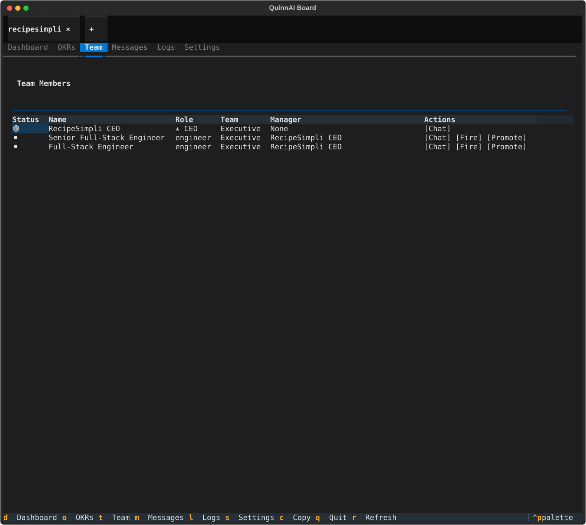

# QuinnAI Board Screenshot

I built an-organization based tree of agents system that can follow okr tracking and hire, fire, promote, etc agents over time as they perform against their tracked org wide goals. 

Screenshot captured: 2026-02-10 at 16:31:58

## Team View

### Team Members

| Status | Name | Role | Team | Manager | Actions |
|--------|------|------|------|---------|---------|
| 🟢 | RecipeSimpli CEO | ★ CEO | Executive | None | [Chat] |
| ⚫ | Senior Full-Stack Engineer | engineer | Executive | RecipeSimpli CEO | [Chat] [Fire] [Promote] |
| ⚫ | Full-Stack Engineer | engineer | Executive | RecipeSimpli CEO | [Chat] [Fire] [Promote] |

### Status Legend
- 🟢 Active/Running
- ⚫ Idle/No Session

### Available Tabs
- Dashboard
- OKRs
- **Team** (current)
- Messages
- Logs
- Settings

### Keyboard Shortcuts
- `d` - Dashboard
- `o` - OKRs
- `t` - Team
- `m` - Messages
- `l` - Logs
- `s` - Settings
- `c` - Copy
- `q` - Quit
- `r` - Refresh
- `^p` - Command palette
